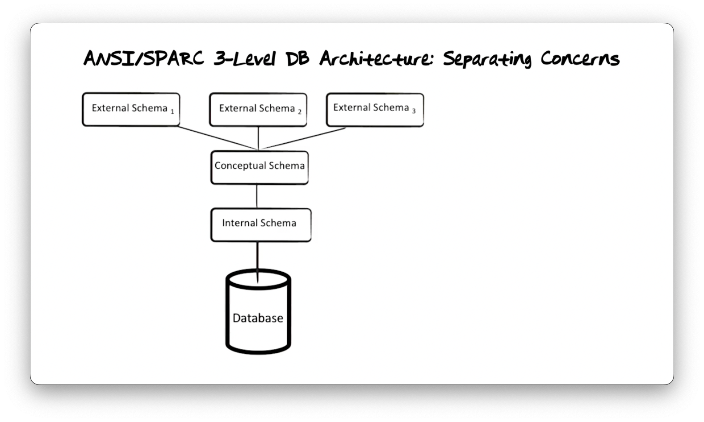
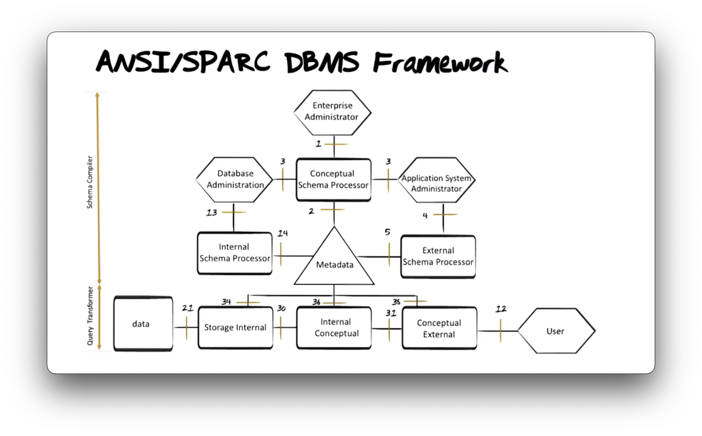

# 01 Database Introduction

## Table of Contents

1. [Overview](#overview)
2. [Database Systems](#database-systems)
3. [Data Models](#data-models)
4. [Database Architecture](#database-architecture)
5. [DBMS Framework](#dbms-framework)
7. [References](#references)

## Overview

A **database** is an organized collection of inter-related data that models some aspect of the real world. Database systems are crucial for managing data in various applications including banking, healthcare, airlines, and e-commerce.

A **Database Management System (DBMS)** is the software that manages a database. A general-purpose DBMS is designed to allow the definition, creation, querying, updating, and administration of databases.

## Database Systems

### Flat-File Database Limitations

Simple text-file-based databases face significant limitations. Consider a social media analytics application using separate text files (Users.txt, Posts.txt, Interactions.txt):

#### Limitation #1: Data Redundancy

When the same information (e.g., "Timothée Chalamet, Paris") is duplicated across multiple entries, it leads to:
- Inconsistencies when data is updated in one place but not others
- Wasted storage space
- Maintenance difficulties

#### Limitation #2: Slow Operations

File-based systems require scanning entire files for data retrieval or updates, resulting in:
- O(n) complexity for most operations
- No optimization for common queries
- Poor performance as data grows

#### Limitation #3: Slow Queries

Without structured access methods, even simple queries require:
- Full file scans
- Manual parsing of text data
- No indexing capabilities

#### Limitation #4: Concurrent Updates

Multiple users trying to modify the same data simultaneously can lead to:
- Data races and corruption
- Lost updates
- Inconsistent state

#### Limitation #5: Handling Disk Failure

Flat files lack mechanisms to ensure data persistence during system crashes:
- No transaction logs
- No recovery mechanisms
- Risk of partial writes

#### Limitation #6: Memory Management

Flat files have inefficient memory management:
- No structured way to manage data between DRAM (fast, volatile) and disk (slow, persistent)
- Entire files may need to be loaded into memory
- No caching strategies

#### Limitation #7: Usability

Poor usability requiring custom code for even simple queries:
- No declarative query language
- Every operation requires imperative programming
- High development overhead

### Relational Database Benefits

Introduced by **Ted Codd (1970)**, relational databases simplify data management by organizing data as tables. Key benefits include:

#### No Data Redundancy

By using primary keys (e.g., UserID) and foreign keys, duplication is minimized:
- Single source of truth for each entity
- References instead of copies
- Normalized data structures

#### Fast Operations & Queries

Benefits from structured data and optimized access paths:
- **Index Database**: B+ trees, hash tables for fast lookups
- Query optimization
- Efficient join algorithms

#### Concurrent Updates

Achieved via **Concurrency Control** mechanisms:
- Locking protocols
- Multi-version concurrency control (MVCC)
- Isolation levels

#### Handling Failures

Guaranteed by **Atomic Transactions** with ACID properties:
- **All or Nothing**: Operations either complete fully or not at all
- **Reversion**: Ability to rollback on failure
- Write-ahead logging (WAL)

#### Memory Management

Differentiates between storage tiers:
- **Cached Pages in DRAM**: Faster access but not durable
- **Disk Storage**: Slower access but durable
- Buffer pool management
- Transaction logs for durability

#### Usability

Utilizes declarative languages like **SQL**:
- Specify *what* you want, not *how* to get it
- Declarative vs. imperative approach
- High-level abstraction
- Reduced development time

## Data Models

A **data model** is a collection of concepts for describing the data in a database.

### Data Structure

Data is represented using **tables** in the relational model:

- **Tables**: Consist of columns (attributes) and rows (entries)
- **Degree**: The number of columns in a table
- **Cardinality**: The number of rows in a table
- **Schema**: Defines the structure (table name, column names, data types)
- **Instance**: The current state of data in the table

**Example Table Structure:**

| Column Name | Data Type | Constraints |
|-------------|-----------|-------------|
| UserID | INTEGER | PRIMARY KEY |
| Name | VARCHAR(100) | NOT NULL |
| Email | VARCHAR(255) | UNIQUE |
| Address | VARCHAR(500) | |

### Constraints

**Constraints** are rules that restrict the data values permitted in a system:

- **Primary Key Constraint**: Uniquely identifies each row
- **Foreign Key Constraint**: Maintains referential integrity between tables
- **Unique Constraint**: Ensures no duplicate values in a column
- **Not Null Constraint**: Requires a value in a column
- **Check Constraint**: Validates data against a condition

### Operations

**Operations** are used to retrieve and change data. Based on **relational algebra** and mathematical set theory:

#### Core Relational Operators

| Operator | Symbol | Description | SQL Equivalent |
|----------|--------|-------------|----------------|
| **Projection** | π | Select specific columns | SELECT columns |
| **Selection** | σ | Filter rows by condition | WHERE clause |
| **Cartesian Product** | × | Combine rows from tables | CROSS JOIN |
| **Union** | ∪ | Combine results | UNION |
| **Difference** | − | Rows in first but not second | EXCEPT |
| **Intersection** | ∩ | Common rows | INTERSECT |
| **Join** | ⋈ | Combine related rows | JOIN |

#### SQL Operations

- **SELECT (Projection)**: Select specific columns from a table
- **WHERE (Selection)**: Filter rows based on conditions
- **GROUP BY (Grouping)**: Group rows with same values
- **Aggregate Functions**: SUM, COUNT, AVG, MIN, MAX
- **JOIN**: Link rows from different tables

**Example:**
```sql
SELECT u.Name, COUNT(p.PostID) as PostCount
FROM Users u
JOIN Posts p ON u.UserID = p.UserID
WHERE u.Address = 'Paris'
GROUP BY u.Name
HAVING COUNT(p.PostID) > 5;
```

### Integrity and Consistency

#### Integrity

**Integrity** refers to how accurately the database reflects reality:
- Data matches real-world state
- Constraints enforced
- Valid relationships maintained

**Poor Integrity Example**: Database shows a user's age as 200 years old.

#### Consistency

**Consistency** relates to the absence of internal conflicts within a database:
- No contradictory values
- Referential integrity maintained
- Constraints satisfied

**Inconsistency Example**: A Post record references a UserID that doesn't exist in the Users table.

### Surrogate Keys

To handle changes in entity information over time, databases use **surrogate keys**:

**Problem**: Natural identifiers (like email or name) can change.

**Solution**: System-generated unique identifiers (surrogate keys) that:
- Never change
- Have no business meaning
- Provide stable references
- Simplify relationships

**Example:**

Without Surrogate:
```
Users(Email, Name, Address)
Email is primary key but can change
```

With Surrogate:
```
Users(UserID, Email, Name, Address)
UserID is primary key and never changes
```

## Database Architecture

The **ANSI/SPARC Three-Level Architecture** separates data representation into three schema levels, enabling efficient data access and independence.



### Conceptual Schema

The **conceptual schema** describes general and time-invariant structures of reality.

**Characteristics:**
- Does not involve data representation details
- No physical organization concerns
- Focus on data meaning and relationships
- Platform-independent

**Contents:**
- Entity definitions
- Relationships between entities
- Integrity constraints
- Business rules

**Example:**
```sql
CREATE TABLE Users (
    UserID INTEGER PRIMARY KEY,
    Name VARCHAR(100) NOT NULL,
    Email VARCHAR(255) UNIQUE,
    Address VARCHAR(500)
);
```

### External Schema

The **external schema** represents a subset of information derived from the conceptual schema, designed for specific user group needs.

**Characteristics:**
- User-specific views
- Simplified or restricted data access
- Security through data hiding
- Customized presentation

**Implementation:**
Views serve as windows into the database rather than physically existing as separate tables.

**Example:**
```sql
CREATE VIEW ActiveUsers AS
SELECT UserID, Name, Email
FROM Users
WHERE LastLoginDate > CURRENT_DATE - INTERVAL '30 days';
```

### Internal Schema

The **internal schema** describes the physical representation of data specified in the conceptual schema.

**Primary Technique: Indexing**
- Optimizes query performance
- Improves update efficiency
- Not directly accessed by applications
- Can be modified without affecting applications

**Storage Considerations:**
- File organization (heap, sorted, hashed)
- Access paths (B+ trees, hash indexes)
- Compression techniques
- Partitioning strategies

### Data Independence

#### Physical Data Independence

The ability to modify the internal schema without affecting external schema-based applications:
- Change storage structures
- Add or remove indexes
- Modify file organization
- Applications remain unaffected

#### Logical Data Independence

The ability to change the conceptual schema without changing applications that run on the external schemata:
- Add new tables or columns
- Modify relationships
- Change constraints
- Views can insulate applications from changes

## DBMS Framework

The **ANSI/SPARC DBMS Framework** (proposed in 1975) defines the components of a three-level architecture.



### Schema Compiler

The **schema compiler** handles schema definitions from different administrators:

| Administrator | Responsibility | Schema Type |
|---------------|----------------|-------------|
| **Enterprise Administrator** | Defines overall data structure | Conceptual Schema |
| **Application System Administrator** | Defines user views | External Schema |
| **Database Administrator** | Defines storage details | Internal Schema |

**Process:**
1. Schema definitions are submitted
2. Checked for syntax correctness
3. Validated against existing schemas
4. Stored in the **metadatabase** (data dictionary)

### Query Transformer

The **query transformer** translates user queries through schema levels:

**Query Flow:**
1. **User submits query** at external schema level
2. **External → Conceptual**: Resolve view definitions
3. **Conceptual → Internal**: Determine access paths and physical operations
4. **Internal → Storage**: Generate operating system calls

**Optimization Steps:**
- Query parsing and validation
- Logical optimization (relational algebra)
- Physical optimization (access method selection)
- Cost-based optimization

### Internal Schema to Storage Transformer

Translates internal schema operations into **operating system calls** to retrieve data from storage:

**Operations:**
- File system interactions
- Buffer management
- Disk I/O scheduling
- Cache management

### Response Processing

The process is reversed when preparing a response:
1. **Data retrieved** from storage
2. **Storage → Internal**: Deserialize data structures
3. **Internal → Conceptual**: Apply data transformations
4. **Conceptual → External**: Filter and format for specific view
5. **Return to user** in requested format

In production systems, this process is highly optimized for efficiency while maintaining the same functional behavior.

## References

**Course Materials:**
- CS 6400: Database Systems Concepts and Design - Georgia Tech OMSCS
- CS 6422: Database System Implementation - Georgia Tech OMSCS

