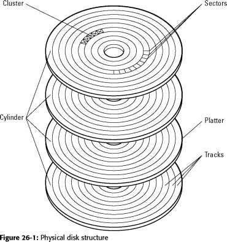

# 03 Database Design

## Table of Contents

1. [Overview](#overview)
2. [Normalization](#normalization)
3. [Functional Dependencies](#functional-dependencies)
4. [Normal Forms](#normal-forms)
5. [Armstrong's Axioms](#armstrongs-axioms)
6. [Database Architecture](#database-architecture)
7. [Data Organization](#data-organization)
9. [References](#references)

## Overview

Database design involves organizing data to minimize redundancy, ensure data integrity, and optimize performance. This chapter covers normalization theory, which provides a systematic approach to database design, as well as physical storage considerations.

**Key Goals:**
- Eliminate data redundancy
- Prevent anomalies (insertion, deletion, update)
- Ensure data integrity
- Optimize storage and access performance

## Normalization

**Normalization** is the process of organizing data in a database to reduce redundancy and dependency. It involves decomposing tables into smaller, well-structured tables without losing information.

### Non-Normalized Problems

Non-normalized databases suffer from several critical issues:

#### 1. Redundancy Problems

**Data Redundancy** occurs when the same information is stored in multiple places, leading to:

**Insertion Anomaly:**
- Cannot insert data without all related information
- Example: Cannot add a new department unless an employee is assigned to it

**Deletion Anomaly:**
- Deleting one piece of information causes unintended loss of other information
- Example: Deleting the last employee in a department removes all department information

**Update Anomaly:**
- Changes must be made in multiple places
- Inconsistency if updates are not applied everywhere
- Example: Changing a department name requires updating every employee record in that department

**Example of Redundant Table:**

| EmployeeID | Name | DepartmentID | DepartmentName | DepartmentLocation |
|------------|------|--------------|----------------|-------------------|
| 1 | Alice | 10 | Sales | Building A |
| 2 | Bob | 10 | Sales | Building A |
| 3 | Carol | 20 | Engineering | Building B |

**Problems:**
- "Sales" and "Building A" repeated for every sales employee
- If "Sales" moves to "Building C", must update multiple rows
- Deleting all Sales employees loses department information

#### 2. Information Loss

**Information Loss** happens when decomposing a table improperly, leading to:
- Inability to reconstruct original data
- Loss of relationships between data
- Incorrect data representation

**Example of Lossy Decomposition:**

Original Table:
| StudentID | CourseID | Instructor |
|-----------|----------|-----------|
| 1 | CS101 | Dr. Smith |

Bad Decomposition:
Table 1: (StudentID, Instructor)
Table 2: (CourseID, Instructor)

**Problem:** Cannot determine which student took which course with which instructor.

#### 3. Dependency Loss

**Dependency Loss** occurs when functional dependencies that existed in the original table cannot be enforced in the decomposed tables.

**Example:**
- Original constraint: "Each course has one instructor"
- After bad decomposition: This constraint cannot be enforced

## Functional Dependencies

**Functional Dependency (FD)** is a relationship between attributes where one set of attributes uniquely determines another set of attributes.

### Definition

For a relation R, **X → Y** (X functionally determines Y) means:
- For each value of X in R, there is precisely one value of Y in R
- Whenever two tuples have the same value for X, they must have the same value for Y

**Notation:** X → Y reads as "X determines Y" or "Y is functionally dependent on X"

### Types of Functional Dependencies

#### Full Functional Dependency

**Y is fully functionally dependent on X** if:
- Y is dependent on X, AND
- Y is not dependent on any proper subset of X

**Example:**
```
(StudentID, CourseID) → Grade

This is a full dependency because:
- Grade depends on both StudentID AND CourseID
- Grade does not depend on StudentID alone
- Grade does not depend on CourseID alone
```

#### Partial Dependency

**Y is partially dependent on X** if:
- Y is dependent on X, BUT
- Y is also dependent on a proper subset of X

**Example:**
```
(StudentID, CourseID) → StudentName

This is a partial dependency because:
- StudentName depends on (StudentID, CourseID)
- StudentName also depends on just StudentID
```

#### Transitive Dependency

**Y is transitively dependent on X** if:
- X → Z AND Z → Y
- Therefore X → Y through Z

**Example:**
```
StudentID → DepartmentID
DepartmentID → DepartmentName
Therefore: StudentID → DepartmentName (transitive)
```

### Keys and Functional Dependencies

**Keys** are used to enforce functional dependencies:

| Key Type | Role in FD |
|----------|------------|
| **Super Key** | Any set of attributes that determines all other attributes |
| **Candidate Key** | Minimal super key (no proper subset is a super key) |
| **Primary Key** | Chosen candidate key used for tuple identification |

**Making X the key** in a relation enforces the dependency that X determines all other attributes (X → Y for all Y).

### Enforcing Functional Dependencies

Functional dependencies ensure:
- **Uniqueness**: Each X value maps to exactly one Y value
- **One-to-One Relationship**: Between X and Y values in the relation

**Implementation:**
- Use PRIMARY KEY constraints
- Use UNIQUE constraints
- Define foreign keys appropriately

## Normal Forms

Normal forms provide a progression of rules for organizing database tables, each building on the previous.

### First Normal Form (1NF)

**Definition:** All domain values in a relation R are **atomic** (indivisible).

**Requirements:**
- No repeating groups
- No arrays or lists in a single cell
- Each cell contains a single value
- All entries in a column are of the same data type

**Note:** All proper relations are automatically in 1NF due to the definition of the relational model.

**Example:**

**Violation of 1NF:**
| StudentID | Name | PhoneNumbers |
|-----------|------|--------------|
| 1 | Alice | 555-1234, 555-5678 |

**Corrected to 1NF:**
| StudentID | Name | PhoneNumber |
|-----------|------|-------------|
| 1 | Alice | 555-1234 |
| 1 | Alice | 555-5678 |

### Second Normal Form (2NF)

**Definition:** R is in 2NF if:
1. R is in 1NF, AND
2. Every non-key attribute is **fully functionally dependent** on the key (no partial dependencies)

**Target:** Eliminate partial dependencies

**Process:**
- Identify partial dependencies
- Decompose table to remove them

**Example:**

**Violation of 2NF:**
```
Enrollment(StudentID, CourseID, StudentName, CourseName, Grade)
Primary Key: (StudentID, CourseID)

Partial Dependencies:
- StudentID → StudentName
- CourseID → CourseName
```

**Corrected to 2NF:**
```sql
Student(StudentID, StudentName)
Course(CourseID, CourseName)
Enrollment(StudentID, CourseID, Grade)
```

### Third Normal Form (3NF)

**Definition:** R is in 3NF if:
1. R is in 2NF, AND
2. Every non-key attribute is **non-transitively dependent** on the key

**Target:** Eliminate transitive dependencies

**Process:**
- Identify transitive dependencies
- Decompose table to remove them

**Example:**

**Violation of 3NF:**
```
Employee(EmployeeID, DepartmentID, DepartmentName)

Transitive Dependency:
- EmployeeID → DepartmentID
- DepartmentID → DepartmentName
- Therefore: EmployeeID → DepartmentName (transitive)
```

**Corrected to 3NF:**
```sql
Employee(EmployeeID, DepartmentID)
Department(DepartmentID, DepartmentName)
```

### Boyce-Codd Normal Form (BCNF)

**Definition:** R is in BCNF if:
1. R is in 3NF, AND
2. Every **determinant** is a candidate key

**Determinant:** A set of attributes in R on which some other attribute is fully functionally dependent.

**BCNF is stricter than 3NF:**
- 3NF allows non-key attributes to determine other non-key attributes
- BCNF requires every determinant to be a candidate key

**Example:**

**Violation of BCNF (but in 3NF):**
```
CourseSchedule(StudentID, Course, Instructor)
Primary Key: (StudentID, Course)

Functional Dependencies:
- (StudentID, Course) → Instructor (satisfies 3NF)
- Instructor → Course (violates BCNF, Instructor not a candidate key)
```

**Corrected to BCNF:**
```sql
StudentInstructor(StudentID, Instructor)
InstructorCourse(Instructor, Course)
```

### Normal Forms Summary

| Normal Form | Eliminates | Key Requirement |
|-------------|-----------|-----------------|
| **1NF** | Repeating groups | Atomic values |
| **2NF** | Partial dependencies | Full dependency on key |
| **3NF** | Transitive dependencies | Non-transitive dependency on key |
| **BCNF** | All non-candidate key determinants | Every determinant is a candidate key |

**Progression:**
```
1NF ⊂ 2NF ⊂ 3NF ⊂ BCNF
```

Every table in BCNF is also in 3NF, 2NF, and 1NF.

## Armstrong's Axioms

**Armstrong's Axioms** are a set of inference rules for deriving functional dependencies. They are **sound** (only valid FDs are derived) and **complete** (all valid FDs can be derived).

### Primary Rules

#### 1. Reflexivity

**Rule:** If Y is a subset of X, then X → Y

**Example:**
```
If X = {StudentID, Name}, Y = {StudentID}
Then X → Y (trivial dependency)
```

**Application:** Trivial dependencies always hold

#### 2. Augmentation

**Rule:** If X → Y, then WX → WY (for any W)

**Example:**
```
If StudentID → Name
Then (StudentID, CourseID) → (Name, CourseID)
```

**Application:** Adding the same attributes to both sides preserves the dependency

#### 3. Transitivity

**Rule:** If X → Y and Y → Z, then X → Z

**Example:**
```
If StudentID → DepartmentID
And DepartmentID → DepartmentName
Then StudentID → DepartmentName
```

**Application:** Dependencies can be chained

### Derived Rules

From the primary rules, additional useful rules can be derived:

#### Union

**Rule:** If X → Y and X → Z, then X → YZ

**Proof:**
1. X → Y (given)
2. X → Z (given)
3. X → XY (augmentation of 1)
4. XY → YZ (augmentation of 2)
5. X → YZ (transitivity of 3 and 4)

#### Decomposition

**Rule:** If X → YZ, then X → Y and X → Z

**Proof:**
1. X → YZ (given)
2. YZ → Y (reflexivity)
3. X → Y (transitivity of 1 and 2)
4. Similarly, X → Z

#### Pseudotransitivity

**Rule:** If X → Y and WY → Z, then WX → Z

**Application:** Useful for more complex dependency inference

### Applications

Armstrong's Axioms are used to:
- **Derive** all functional dependencies from a given set
- **Determine** candidate keys
- **Verify** normal forms
- **Optimize** database schemas

## Database Architecture

Database architecture describes how data is physically stored and accessed.

### Storage Technologies

Modern databases use a hierarchy of storage technologies:

| Storage Type | Speed | Capacity | Volatility | Cost/GB |
|--------------|-------|----------|----------|---------|
| **CPU Registers** | Fastest | Bytes-KB | Volatile | Highest |
| **CPU Cache (L1/L2/L3)** | Very Fast | KB-MB | Volatile | Very High |
| **DRAM (RAM)** | Fast | GB | Volatile | High |
| **SSD** | Medium | GB-TB | Non-volatile | Medium |
| **HDD** | Slow | TB | Non-volatile | Low |
| **Tape/Cloud** | Very Slow | PB+ | Non-volatile | Lowest |

### Volatile vs. Persistent Storage

#### Volatile Storage (DRAM)

**Characteristics:**
- **Data Lost Without Power**
- Fast access (nanoseconds)
- Limited capacity
- Expensive

**Usage:**
- Cache frequently accessed data ("hot data")
- Buffer pool
- Query execution workspace

#### Persistent Storage (Disk)

**Characteristics:**
- **Data is Safe** after power loss
- Slower access (milliseconds)
- Large capacity
- Inexpensive

**Usage:**
- Permanent data storage
- Transaction logs
- Database files

### Data Lifecycle

The database manages data movement between storage tiers:

```
┌─────────────────────┐
│    Hot Data (RAM)   │ ← Frequently accessed
├─────────────────────┤
│  Warm Data (SSD)    │ ← Moderately accessed
├─────────────────────┤
│   Cold Data (HDD)   │ ← Rarely accessed
└─────────────────────┘
```

**Strategies:**
- Least Recently Used (LRU)
- Most Frequently Used (MFU)
- Clock algorithms

### Data Access Performance

**Main Memory Access:**
- Latency: ~30 nanoseconds (10^-7 seconds)
- Bandwidth: ~GB/s per channel

**Disk Access:**
- Latency: ~10 milliseconds (10^-2 seconds)
- Seek time: 3-8 ms
- Rotational delay: 2-3 ms
- Transfer time: 0.5-1 ms

**Performance Gap:**
- Main memory is approximately **100,000 times faster** than disk
- This gap drives database architecture decisions

## Data Organization

How data is organized on disk significantly impacts performance.

### Disk Structure

Modern hard drives consist of:

**Components:**
- **Platters**: Circular disks with magnetic coating
- **Tracks**: Concentric circles on platter surfaces
- **Sectors**: Fixed-size segments of tracks (typically 512 bytes or 4KB)
- **Cylinders**: Collection of tracks at the same position across platters
- **Read-Write Heads**: Magnetic sensors for each platter surface
- **Actuator**: Moves heads across tracks



**Blocks:**
- Unit of information transferred between disk and main memory
- Typically 4KB, 8KB, or larger
- Multiple records stored in a single block
- Files consist of multiple blocks connected by address pointers

### Storage Strategies

#### Heap (Unsorted Files)

**Characteristics:**
- Records stored in no particular order
- New records appended to end of file
- Simplest organization

**Performance:**

| Operation | Complexity | Notes |
|-----------|-----------|-------|
| **Insert** | O(1) | Append to end |
| **Search** | O(N/2) average | Must scan all blocks |
| **Delete** | O(N/2) | Find then remove |
| **Update** | O(N/2) | Find then modify |

**Use Cases:**
- Small tables
- Tables with mostly sequential scans
- Temporary tables

#### Sorted Files

**Characteristics:**
- Records ordered by a key attribute
- Insertion requires maintaining order
- Binary search possible

**Performance:**

| Operation | Complexity | Notes |
|-----------|-----------|-------|
| **Insert** | O(N) | Must maintain order |
| **Search** | O(log N) | Binary search |
| **Range Query** | O(log N + K) | K = result size |

**Advantages:**
- Fast searches on sort key
- Efficient range queries
- Sequential access benefits

**Disadvantages:**
- Expensive insertions
- Only one sort order

### Indexing

**Indexes** provide fast access paths to data without requiring full table scans.

#### Sparse Primary Index

**Structure:**
- One index entry per data block
- Index stores: (first key in block, pointer to block)
- Requires data to be sorted

**Performance:**
- Search: O(log F) where F = number of blocks
- Space: Minimal index size

#### Dense Primary Index

**Structure:**
- One index entry per record
- Index stores: (key value, pointer to record)
- Requires data to be sorted

**Performance:**
- Search: O(log N) where N = number of records
- Space: Larger index size

#### Secondary Index

**Structure:**
- Built on non-key attributes
- Must be dense (one entry per record)
- Data doesn't need to be sorted on this attribute

**Use Cases:**
- Point queries on non-key attributes
- Attributes frequently used in WHERE clauses

### Multilevel Index

**Concept:** Create an index on the index

**Structure:**
```
┌──────────────────────┐
│   Top-Level Index    │ ← Smallest, fits in memory
├──────────────────────┤
│ Second-Level Index   │
├──────────────────────┤
│  First-Level Index   │ ← Dense or sparse
├──────────────────────┤
│     Data Blocks      │
└──────────────────────┘
```

**Performance:**
- Search: O(log_F N) where F = fanout
- Reduces number of disk accesses significantly

### B+ Tree Index

**B+ Trees** are the most common index structure in databases.

**Characteristics:**
- **Balanced**: All leaves at same depth
- **Sorted**: Keys in order within nodes
- **High Fanout**: Each node contains many keys
- **Leaf Links**: Leaf nodes linked for range scans

**Advantages:**
- Guaranteed logarithmic search time
- Efficient insertions and deletions
- Range queries via leaf traversal
- Self-balancing

**Structure:**
- **Internal Nodes**: Contain keys and pointers to children
- **Leaf Nodes**: Contain keys and pointers to data (or data itself)
- **Order N**: Each node contains between ⌈N/2⌉ and N children

**Performance:**
- Search: O(log_F N)
- Insert: O(log_F N)
- Delete: O(log_F N)
- Range Query: O(log_F N + K) where K = result size

### Hashing

**Hashing** provides constant-time average access for point queries.

#### Static Hashing

**Structure:**
- Hash function: h(key) = bucket number
- Each bucket contains one or more data blocks
- Overflow blocks for collisions

**Hash Function Properties:**
- Uniform distribution of values
- Minimal collisions
- Efficient computation

**Performance:**
- Search: O(1) average, O(N) worst case
- Insert: O(1) average
- Range Query: O(N) (no ordering)

**Limitations:**
- Fixed number of buckets
- Performance degrades as data grows
- No support for range queries

#### Dynamic Hashing

**Approaches:**
- **Extendible Hashing**: Adjust directory size dynamically
- **Linear Hashing**: Grow buckets incrementally

**Advantages:**
- Adapts to data growth
- Maintains constant-time access
- No full reorganization needed

## References

**Course Materials:**
- CS 6400: Database Systems Concepts and Design - Georgia Tech OMSCS
