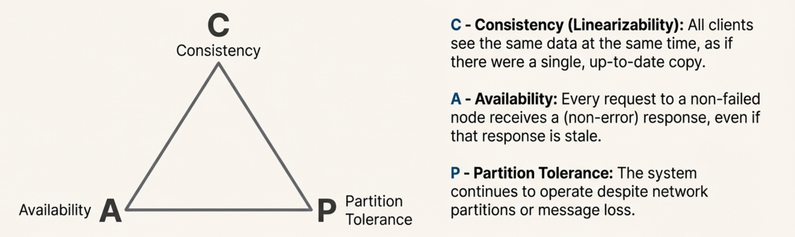
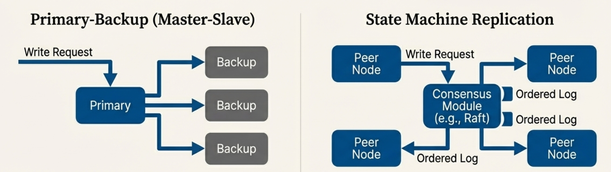
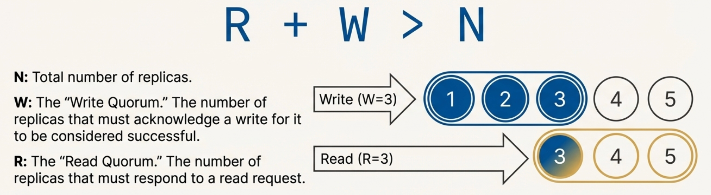

# 01-Distributed System Foundations

## Overview

A distributed system is a collection of autonomous computing nodes that communicate over a network to achieve a common goal. Unlike centralized systems, distributed systems face unique challenges arising from the lack of shared memory, independent node failures, unpredictable network delays, and the fundamental impossibility of perfect coordination.

## Table of Contents

1. [Introduction](#introduction)
2. [System and Failure Models](#system-and-failure-models)
3. [Time, Ordering, and Coordination](#time-ordering-and-coordination)
4. [CAP Theorem](#cap-theorem)
5. [Consistency](#consistency)
6. [Fault Tolerance](#fault-tolerance)
7. [Scalability](#scalability)
8. [Design Principles](#design-principles)

## Introduction

Distributed systems are built because single machines hit limits (performance, reliability, geography, isolation). The price is that the network becomes part of your computer: **latency, partial failure, and concurrency become the default**.

### Defining Characteristics

**Interconnected Autonomous Nodes**

A distributed system is a collection of independent nodes, each with its own processor, memory, and local state, interconnected by a Local Area Network (LAN) or Wide Area Network (WAN). Each node operates autonomously and can make local decisions.

**No Shared Physical Memory**

Nodes do not share physical memory. All communication and coordination must occur through explicit message passing over the network. This fundamental constraint shapes the design of all distributed algorithms.

**Communication Time Dominance**

The time required for message communication between nodes (Tm) is significantly greater than the time to execute local computations (Te). This inequality, **Tm >> Te**, is the defining characteristic of distributed systems according to Lamport's definition:

> *"A system is distributed if the message transmission time is not negligible compared to the time between events in a single process."*

**Implications:** Because communication dominates, distributed algorithms must minimize message passing and maximize local computation. Even modern data center clusters qualify as distributed systems, as network latency remains orders of magnitude higher than local memory access.

**Partial Failure**

Individual nodes or network links can fail independently while the rest of the system continues operating. Unlike centralized systems where a single failure halts everything, distributed systems must gracefully handle partial failures.

**Concurrency**

Multiple nodes execute simultaneously, leading to inherent concurrency. Without perfect synchronization, different nodes may observe events in different orders, creating consistency challenges.

### Motivations for Building Distributed Systems

Despite their inherent complexity, engineers build distributed systems for four primary reasons:

- **High Performance:** Achieve parallelism by harnessing many CPUs, memories, and disks. Goal is N× speedup from N machines. Examples: MapReduce, Spark, scientific computing clusters.

- **Fault Tolerance:** Survive component failures through redundancy. If one computer fails, another takes over. Examples: Replicated databases, distributed file systems (HDFS, GFS).

- **Inherent Distribution:** Some problems are naturally geographically distributed, requiring distributed coordination. Examples: Interbank transfers, global CDNs, distributed sensor networks.

- **Security & Isolation:** Isolate untrusted components through well-defined network protocols. Examples: Microservices, sandboxed code execution, multi-tenant cloud platforms.

Modern distributed systems design primarily focuses on achieving **high performance** and **fault tolerance**.

### Core Challenges

**Concurrency:** Multiple computers executing concurrently face complex interactions, timing-dependent bugs (race conditions), non-deterministic behavior, and need for synchronization without shared memory.

**Partial Failure:** Unlike a single computer that either works or crashes completely, distributed systems experience partial failures where some components crash while others continue. Components may run slowly rather than fail, making it difficult to distinguish slow from failed. Failure detection is inherently unreliable in asynchronous systems.

**Achieving Performance:** The goal of N× speedup from N machines is rarely achieved due to communication overhead, bottlenecks (shared resources like databases), load imbalance, and sequential dependencies (Amdahl's Law). Careful architectural design is required to achieve true scalable performance.

## System and Failure Models

System models define the assumptions about timing, synchronization, and behavior that algorithms can rely upon. Failure models characterize the types of failures that can occur. Together, these models define the "rules of the game" for distributed systems design.

### Safety vs. Liveness

- **Safety**: "nothing bad happens" (e.g., never return two different committed values).
- **Liveness**: "something good eventually happens" (e.g., requests eventually complete).

Many results are phrased as: under certain assumptions you can guarantee safety, but liveness may be impossible (or vice versa).

### Timing / System Models

| Model | Assumptions | What it enables | Key limitation |
|------|-------------|-----------------|----------------|
| **Synchronous** | Known upper bounds on message delay, processing time, and clock drift | **Reliable timeouts** → accurate failure detection | Hard to guarantee in practice (especially WANs) |
| **Asynchronous** | No timing bounds (messages can be arbitrarily delayed; processes arbitrarily slow) | Simple modeling of the Internet | **No perfect failure detection**; FLP shows consensus can’t be guaranteed with 1 crash fault |
| **Partially synchronous** | Bounds exist but are unknown, or hold only after some unknown stabilization time | Practical consensus (e.g., Raft) via timeouts + eventual stability | During unstable periods it behaves like async |

### Communication Assumptions

| Assumption | Meaning | Practical note |
|-----------|---------|----------------|
| **Reliable channel** | Messages aren’t lost/corrupted (or are retransmitted) | TCP-like behavior (still can have partitions) |
| **Unreliable channel** | Loss/duplication/reordering may occur | UDP-like; app must add retries/dedup |
| **Partition possible** | Network can split so some nodes can’t talk | Treat as a first-class fault in design |

### Failure Models

| Failure | What happens | Notes |
|--------|--------------|------|
| **Crash (fail-stop)** | Node halts and stops responding | Common model for consensus/replication |
| **Omission** | Node drops some sends/receives | Includes message loss behaviors |
| **Timing** | Node misses known deadlines | Mostly relevant under synchronous assumptions |
| **Byzantine** | Node behaves arbitrarily/maliciously | Expensive: typically **3f+1** replicas to tolerate **f** faults |
| **Partition** | Network splits into components | Can cause split-brain without coordination |

**Rule of thumb:** most production data systems assume **crash failures + partial synchrony**, and then engineer around partitions via quorums/consensus.

## Time, Ordering, and Coordination

Distributed systems often need to answer: **in what order did things happen?** On a single machine, a shared clock and shared memory make this feel easy. In a distributed system, it’s not.

### Why ordering is hard (3 bullets)

- **No global clock**: clocks drift; synchronization reduces error but never eliminates it.
- **Unpredictable delay**: message latency varies and reordering can occur.
- **Failures look like slowness**: timeouts can’t perfectly distinguish a slow node from a crashed/partitioned one.

### What systems do about it

- Use **logical time / causality** tools (happened-before, Lamport clocks, vector clocks) to reason about ordering.
- Use **coordination** (e.g., consensus + state machine replication) when replicas must agree on one order.

For the detailed treatment of causality and Lamport clocks, see `Distributed System/02-Communication.md`.

## CAP Theorem

The CAP theorem (Brewer's theorem) is a fundamental impossibility result: a distributed system cannot simultaneously guarantee all three of the following properties:

### The Three Properties

**Consistency (C)**

All clients observe operations as if there were a single, up-to-date copy of the data (commonly interpreted as **linearizability** for reads/writes).

**Availability (A)**

Every request to a **non-failed** node eventually receives a (non-error) response. The response may be stale if you choose availability over consistency during a partition.

**Partition Tolerance (P)**

The system continues to operate despite arbitrary message loss or network partitions. Nodes may be temporarily unable to communicate.

### The Impossibility

In the presence of a network partition (P), which is unavoidable in real-world distributed systems, you must choose between consistency (C) and availability (A):

**CP Systems (Consistency + Partition Tolerance)**

Sacrifice availability during partitions. Some nodes may refuse requests to maintain consistency.

*Examples:* HBase, MongoDB (with majority writes), Redis (with synchronous replication), distributed databases with strong consistency.

*Use Case:* Financial systems, inventory management, any system where returning stale data is unacceptable.

**AP Systems (Availability + Partition Tolerance)**

Sacrifice consistency during partitions. All nodes remain available but may return stale data.

*Examples:* Cassandra, DynamoDB, Riak, Couchbase, DNS.

*Use Case:* Social media feeds, content delivery networks, shopping carts, systems where availability trumps consistency.

**CA Systems (Consistency + Availability)**

Only possible if you **assume partitions do not occur** (or you are willing to treat partitions as failures that break availability/operation). In practice, partitions can happen even within a single data center.

*Examples:* Traditional RDBMS (PostgreSQL, MySQL) on a single node or with synchronous replication in a tightly-coupled cluster.

### Practical Implications

**Networks are unreliable:** Partitions happen in practice, so P is not optional. The real choice is between C and A during partitions.

**Not binary:** Real systems often provide tunable consistency levels (e.g., Cassandra's quorum reads/writes) allowing applications to choose their trade-off point.

**Eventually consistent systems:** Many AP systems provide eventual consistency—if writes stop, all replicas eventually converge to the same state.

## Consistency

Consistency models define the guarantees about the order and visibility of operations in a distributed system. In a replicated storage system, **consistency defines the rules about what a client will see when reading data after it has been written**. With multiple replicas of data distributed across different machines, ambiguity can arise about which version of the data is "correct."

### The Fundamental Trade-off

**Example:** A distributed key-value store has two replicas with `k1=20`. A client updates Replica A to `k1=21`, but the update doesn't reach Replica B before the client crashes. A subsequent `get("k1")` could return either `21` or `20`, depending on which replica responds.

This leads to a fundamental trade-off:

- **Strong Consistency:** Always returns the most recent write (`21`). Requires expensive coordination between replicas on every operation. Use for financial transactions and inventory systems.

- **Weak Consistency:** May return stale data (`20`). No coordination needed, providing low latency and high availability. Use for social media feeds and content delivery networks.

The trade-off becomes acute with geographic distribution. Cross-continent communication latency (100-200ms) makes strong consistency prohibitively expensive for interactive applications.

### Strong Consistency (Linearizability)

Operations appear to occur instantaneously at some point between invocation and completion. Equivalent to a single, global, correct order.

**Guarantee:** If operation A completes before operation B begins, then A appears before B in the global order. A read always returns the value from the most recent completed write.

**Cost:** High latency, reduced availability (requires coordination between replicas).

**Implementation:** Typically requires consensus protocols (Paxos, Raft) or quorum-based coordination.

**Example:** Read returns the value of the most recent completed write, even if replicas are distributed globally.

### Sequential Consistency

Operations appear to execute in some sequential order, and operations of each process appear in program order.

**Weaker than linearizability:** Doesn't respect real-time ordering across processes.

**Example:** All processes see writes in the same order, but not necessarily the real-time order.

### Causal Consistency

Operations that are causally related must be seen in causal order by all processes. Concurrent operations may be seen in different orders by different processes.

**Based on:** Lamport's "Happened Before" relationship.

**Example:** If write W1 happens before write W2 (causally), all processes see W1 before W2. But if W1 and W2 are concurrent, different processes may see them in different orders.

### Eventual Consistency

If no new updates are made, all replicas eventually converge to the same state.

**Weakest useful model:** Provides no guarantees about the order or timing of convergence.

**Highly available:** No coordination required for reads or writes.

**Examples:** DNS, Amazon's shopping cart, Cassandra with eventual consistency settings.

**Challenges:** Application must handle stale reads, conflicts, and convergence detection.

## Fault Tolerance

At scale, component failures become a constant reality rather than exceptional events. While a single server might have a mean time between failures of one year, a system built from 1,000 computers will experience approximately **three failures per day** (1000 machines ÷ 365 days). Failures—crashed machines, faulty network cables, overheated switches, power outages—must be treated as a normal, constant state of operation, not a rare anomaly.

Replication is the primary mechanism for achieving fault tolerance and high availability in distributed systems.

### Availability vs. Recoverability

- **Availability:** System continues operating *during* failures. Achieved through **replication**—multiple copies of services and data route around failures. Example: A web service with 5 replicas continues serving requests even if 2 crash.

- **Recoverability:** System can restart correctly *after* failures are repaired. Achieved through **non-volatile storage**—persisting state to disk via checkpoints or logs. Example: A database restarts from its write-ahead log and recovers all committed transactions.

### Two Primary Tools for Fault Tolerance

**Non-Volatile Storage:** Persists system state using checkpointing (periodic snapshots), write-ahead logging (recording operations before applying), or journaling (maintaining a log of recent changes). Essential for recoverability but does not provide availability.

**Replication:** Maintains multiple copies of data or services on different machines. If one replica fails, others immediately take over. The central challenge is ensuring replicas stay consistent (see Consistency Models section).

### Why Replicate?

**Fault Tolerance:** If one replica fails, others can continue serving requests without interruption.

**High Availability:** Distribute load across replicas, reducing latency and increasing throughput.

**Locality:** Place replicas geographically close to users for faster access (e.g., CDNs with servers on every continent).

### Replication Strategies

**Primary-Backup (Master-Slave)**

One primary replica handles all writes; backups passively replicate the primary's state.

*Advantages:* Simple, strong consistency.

*Disadvantages:* Primary can be a bottleneck and, without automated failover, a single point of failure.

**Multi-Primary (Multi-Master)**

Multiple replicas can accept writes simultaneously.

*Advantages:* Higher write throughput, no single point of failure.

*Disadvantages:* Conflict resolution required, eventual consistency.

**State Machine Replication**

Replicas start in the same state and deterministically apply the same operations in the same order.

*Key Requirement:* Consensus on operation order (e.g., via Paxos or Raft).

*Advantages:* Strong consistency, fault tolerance.

### Quorum Systems

Require agreement from a majority (or weighted quorum) of replicas before completing operations.

**Read Quorum (R) + Write Quorum (W) > N:** Ensures read and write quorums **overlap** (quorum intersection), which is a building block for strong behavior.

**Example:** In a system with 5 replicas, W=3 and R=3 ensures consistency.

**Trade-off:** Tune R and W for consistency vs. availability/latency. Higher W/R increases coordination cost and reduces availability during failures.

## Scalability

Scalability is the ability of a system to handle increasing load by adding resources. The ultimate goal is **scalable speed-up**: N× resources yields N× performance or throughput.

### Horizontal vs. Vertical Scaling

**Horizontal Scaling (Scale Out):** Add more nodes to the system. Preferred approach for distributed systems as it's more cost-effective and provides better fault tolerance through redundancy.

**Vertical Scaling (Scale Up):** Upgrade to more powerful nodes (more CPU, RAM, storage). Limited by hardware constraints and cost. Single point of failure remains.

### Bottlenecks and Performance Challenges

**Scalability is rarely infinite.** Bottlenecks emerge as systems grow:

**Common Bottleneck Pattern:** A website scales by adding web servers until the shared database becomes the bottleneck. Adding more web servers yields no improvement—further scaling requires re-architecting the database through sharding, replication, or caching. Each resolved bottleneck often reveals the next.

**Key Challenges:**
- **Communication Overhead:** Network latency dominates, making coordination expensive (Tm >> Te)
- **Shared Resources:** Databases, coordinators, and shared state limit parallelism
- **Load Imbalance:** Work may not distribute evenly across nodes
- **Amdahl's Law:** Sequential dependencies limit maximum speedup

### Techniques for Scalability

**Partitioning/Sharding:** Divide data across multiple nodes based on a partition key. Enables parallel processing and distributes load.

**Caching:** Store frequently accessed data in fast storage (memory) closer to clients. Reduces load on backend systems.

**Load Balancing:** Distribute requests evenly across multiple servers. Prevents hotspots and maximizes resource utilization.

**Asynchronous Processing:** Decouple request handling from processing. Use message queues to handle bursts and smooth load.

## Design Principles

Key principles for designing distributed systems:

**Design for Partial Failure:** Individual components will fail independently. Systems must detect failures, isolate faulty components, and continue operating with reduced capacity. Use health checks, timeouts, circuit breakers, and graceful degradation.

**Minimize Communication:** Since communication dominates computation time (Tm >> Te), algorithms should maximize local work and minimize message passing. Batch operations when possible. Avoid distributed state—shared mutable state across nodes is expensive to maintain consistently. Prefer immutable data, local state, and stateless services.

**Use Idempotent Operations:** Design operations that can be safely retried without changing the result. Critical for handling message duplication and failures. Example: `SET x = 5` is idempotent, but `INCREMENT x` is not.

**Plan for Retries and Deduplication:** At-least-once delivery is common in real systems. Add request IDs, dedupe tables, and careful semantics at boundaries (HTTP, queues, RPC).

**Accept Trade-offs:** Perfect solutions don't exist. CAP theorem, FLP impossibility, and latency constraints force trade-offs between consistency, availability, performance, and simplicity. Choose trade-offs that align with application requirements.

## References

- CS 6210: Advanced Operating Systems - Georgia Tech OMSCS
- MIT 6.824: Distributed Systems
