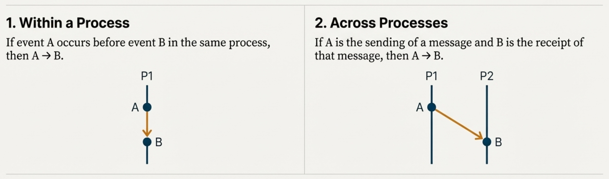

# 02-Distributed Communication

## Table of Contents

1. [Event Ordering](#event-ordering)
2. [Clocks and Synchronization](#clocks-and-synchronization)
3. [Communication and Remote Procedure Calls](#communication-and-remote-procedure-calls)
4. [Software Defined Networking (SDN)](#software-defined-networking-sdn)

## Event Ordering

In distributed systems where communication time dominates computation time (Tm >> Te), establishing a consistent ordering of events across autonomous nodes becomes a fundamental challenge. Without a shared global clock or shared memory, we need formal mechanisms to reason about causality and event relationships.

### The "Happened Before" Relationship

To reason about causality and event order without a global clock, Lamport introduced the **"Happened Before"** relationship, denoted by `A -> B` ("A happened before B"). This relationship establishes a partial ordering of events based on causal relationships.

#### Definition



The "Happened Before" relationship is defined by two conditions:

1. **Events within the same process:** If events A and B occur in the same process and A occurs before B in the process's sequential execution, then `A -> B`.

2. **Events connected by communication:** If A is the event of sending a message from one process and B is the event of receiving that same message in another process, then `A -> B`.

#### Transitivity

This relationship is also **transitive**: if `A -> B` and `B -> C`, then `A -> C`.

The transitivity property allows us to establish causal chains across multiple processes and multiple message exchanges, enabling reasoning about complex distributed computations.

### Concurrent Events and Partial Ordering

Events that are not related by the "Happened Before" relationship (either directly or transitively) are considered **concurrent**. If events A and B are concurrent, it is impossible to definitively state that one occurred before the other—in different executions, their real-time ordering can vary.

This concurrency means the "Happened Before" relationship provides only a **partial order** of all events in the system. Not all pairs of events can be ordered with respect to each other. Robust distributed algorithms must explicitly recognize which events are causally related and which are concurrent, as assuming a specific order for concurrent events is a common source of timing bugs.

## Clocks and Synchronization

### Lamport's Logical Clock

The logical clock is a simple, monotonically increasing counter (or "clock"), `Ci`, maintained by each process `Pi`. It associates a numerical timestamp `C(e)` with every event `e`.

#### Timestamp Assignment Rules

1. **Local Events:** For two successive events `a` and `b` within the same process, the timestamp of `b` must be greater than the timestamp of `a` (`C(b) > C(a)`). This is achieved by incrementing the local clock between events.

2. **Communication Events:** A message sent from process `Pi` carries the timestamp of the send event, `C(send)`. When process `Pj` receives this message, it must assign a timestamp `C(receive)` to the receive event such that `C(receive) > C(send)`.

   - Specifically, the receiving process `Pj` sets its local clock `Cj` to `MAX(current Cj, incoming C(send)) + 1` (or some other increment). This ensures the causality principle (a message cannot be received before it is sent) is respected in the logical timeline.

#### Key Property

If an event `a` happened before `b` (`a -> b`), then `C(a) < C(b)`. However, the converse is not true: `C(x) < C(y)` does **not** necessarily mean `x -> y`. The events could be concurrent, with arbitrary timestamp ordering.

#### Example

Consider three processes P1, P2, and P3:

```
P1: e1(1) -> e2(2) -> send(3) -> e4(4)
                        |
                        v
P2: e5(1) -> e6(2) -> recv(4) -> e7(5) -> send(6)
                                            |
                                            v
P3: e8(1) -> e9(2) -> e10(3) -> recv(7) -> e11(8)
```

Note how the receive operations update their clocks to be greater than the timestamp carried by the incoming message.

### Achieving Total Order

While partial ordering is sufficient for many applications, some problems (e.g., distributed mutual exclusion) require a definitive, total order of all events. Lamport's total order extends the logical clock by introducing a deterministic tie-breaking rule.

#### The Need for Total Order

In a car-sharing example, if two family members request the car with the same logical timestamp, a conflict arises. A tie-breaking rule, such as "age wins" or "lower process ID wins," is needed to make an unambiguous decision.

#### Formulation

An event `a` in process `Pi` is said to precede event `b` in process `Pj` in the total order if:

1. The logical timestamp `C(a) < C(b)`, **OR**
2. The timestamps are equal (`C(a) = C(b)`) **AND** the process ID `Pi < Pj`.

Any arbitrary, globally-known condition can be used for tie-breaking. This mechanism allows every node to independently derive the exact same total ordering of all events in the system.

### Distributed Mutual Exclusion

This algorithm uses Lamport's total order to implement a lock without shared memory, demonstrating the power of logical timestamps in coordination protocols.

#### Protocol

1. **Request:** A process `Pi` wanting to acquire a lock sends a timestamped request message to all other processes and adds the request to its own local queue.

2. **Receipt:** When a process `Pj` receives a request, it places it in its local queue, ordered by the request's total order (timestamp, then process ID), and sends an acknowledgment (ACK) back to `Pi`.

3. **Acquire Lock:** Process `Pi` can acquire the lock only when two conditions are met:
   - Its own request is at the top of its local queue.
   - It has received messages (either ACKs or later-timestamped requests) from all other processes. This confirms that no other process has an older, outstanding request.

4. **Release Lock:** To release the lock, the process removes its request from its own queue and sends an `unlock` message to all other processes, which then remove the corresponding entry from their queues.

#### Message Complexity

This algorithm requires `3(N-1)` messages per lock-unlock cycle:
- `N-1` request messages
- `N-1` ACK messages
- `N-1` unlock messages

**Optimization:** This can be reduced to `2(N-1)` messages by deferring an ACK if the receiving node has an older pending request. Its eventual `unlock` message then serves as the implicit acknowledgment.

#### Correctness

The algorithm guarantees mutual exclusion because:
1. All processes agree on the same total order of requests
2. A process can only enter the critical section when its request is at the head of this order
3. The requirement to hear from all other processes ensures no older request exists

### Lamport's Physical Clock

Logical clocks are insufficient for real-world scenarios that depend on wall-clock time, as they are vulnerable to anomalies caused by clock drift. Lamport's Physical Clock establishes conditions to guarantee that if event `a` happened before `b` in real time, their timestamps will reflect this order.

#### The Clock Drift Problem

Computer clocks are imperfect and can drift, running faster or slower than real time. This drift can be:
- **Individual:** One clock relative to real time
- **Mutual:** Two clocks relative to each other

#### Real-World Anomaly Example

Consider an email system where Alice sends an email at 10:00:05, Bob receives it and replies at 10:00:03 (his clock is slow), and Alice receives the reply at 10:00:04. The timestamps suggest Bob replied before Alice sent the original message—a causality violation caused by clock drift.

#### Physical Clock Conditions

To prevent time-related anomalies, two conditions must be met:

1. **PC1 - Bounded Individual Drift:** Each clock's drift rate relative to real time must be bounded by a small constant `k` (typically < 10⁻⁶).

2. **PC2 - Bounded Mutual Drift:** The difference between any two clocks at the same moment must be bounded by a small constant `ε`.

**Key Insight:** If the inter-process communication time `μ` is significantly larger than the potential clock drift (`μ ≥ ε / (1 - k)`), anomalies can be avoided. In practice, this means physical clocks can be synchronized well enough for distributed systems as long as network latency dominates clock drift rates.

#### Practical Implementation

In practice, this is achieved through clock synchronization protocols such as:
- **Network Time Protocol (NTP):** Synchronizes clocks across the Internet
- **Precision Time Protocol (PTP):** Provides microsecond-level synchronization in LANs
- **GPS-based synchronization:** Uses atomic clocks from satellites

## Communication and Remote Procedure Calls

### Components of RPC Latency

The end-to-end latency of an RPC involves several phases, each adding overhead:

| Phase              | Description                                                  | Overhead Type |
|--------------------|--------------------------------------------------------------|---------------|
| Client Call        | Marshal arguments, make kernel call                          | Software      |
| Network Send       | DMA to network controller, transmit packet                   | Hardware      |
| Network Transit    | Packet travels across network                                | Physical      |
| Server Receive     | Interrupt handling, move packet to memory                    | HW/SW         |
| Server Dispatch    | Unmarshal arguments, locate and invoke server procedure      | Software      |
| Server Execution   | Execute procedure logic, prepare reply                       | Application   |
| Return Path        | Send, transit, and receive reply (reverse of above steps)    | HW/Physical/SW|
| Client Resume      | Receive interrupt, reactivate client process                 | Software      |

The key optimization targets are **marshaling/data copying**, **context switches**, and **protocol processing**.

### Marshaling and Data Copying

This is often the largest source of overhead. A naive implementation involves three memory copies:
1. **Client stub** copies arguments from stack to user-space buffer
2. **Kernel** copies from user-space to kernel buffer
3. **DMA** copies from kernel buffer to network controller

**Optimization Techniques:**

The DMA copy is unavoidable, but the first two can be reduced:

- **Push Stub into Kernel:** Install stub code in kernel at bind time, allowing direct marshaling from client stack to kernel buffer (eliminates one copy)
- **Shared Descriptors:** User-space stub creates a descriptor of argument layout; kernel performs "gather" operation directly into network buffer (eliminates one copy, maintains user-space model)

Both optimizations reduce the copy count from 3 to 2 (~33% reduction).

### Control Transfer (Context Switches)

A full RPC round-trip can involve up to four context switches:
- Client blocks → switch to another process (overlappable with network I/O)
- Server woken up → **critical switch**
- Server replies → switch to another process (overlappable)
- Client woken up → **critical switch**

**Optimizations:**
- **Overlap with I/O:** Non-critical switches (1 and 3) can be hidden during network transmission, leaving only two critical switches
- **Spin-waiting:** For fast LANs, client can poll for the reply instead of blocking, eliminating client-side switches entirely (trades CPU utilization for latency)

### Protocol Processing

For reliable LANs, general-purpose protocols like TCP/IP introduce unnecessary overhead. A leaner RPC-specific protocol can make optimizations:

**Key Optimizations:**
- **Implicit ACKs:** The server's reply acknowledges the request; the client's next action acknowledges the reply (eliminates separate ACK packets, ~40% fewer messages)
- **Hardware checksums:** Offload validation to NIC hardware
- **Smart buffering:** Client needn't buffer requests (can regenerate on loss); server buffers replies during transmission only

**RPC-Specific Features:** Connection-less operation, idempotency tracking, at-most-once semantics via request IDs, adaptive timeouts, and request batching.

### RPC Implementations

**Java RMI (Historical):** An early object-oriented RPC system for distributed Java applications. It provided remote object references, automatic marshaling via serialization, and integrated naming services. However, it was Java-only and used synchronous blocking calls.

**Modern RPC (gRPC, Thrift):** Contemporary systems use language-agnostic protocols with:
- **Interface Definition Languages (IDL):** Protocol Buffers, Thrift IDL for cross-language compatibility
- **HTTP/2-based transport:** Multiplexing, streaming, flow control
- **Code generation:** Automatic client/server stub generation from IDL
- **Async support:** Non-blocking calls, streaming RPCs (unary, server-streaming, client-streaming, bidirectional)

Modern RPC frameworks address Java RMI's limitations while maintaining the core benefits of abstraction, type safety, and automatic serialization.

## Software Defined Networking (SDN)

### Historical Context: Active Networks

Active Networks (1990s-2000s) was a research paradigm proposing programmable routers that could execute application-supplied code on packets at intermediate nodes. While never deployed at scale due to security concerns, performance limitations, and vendor resistance, it introduced foundational concepts that profoundly influenced modern networking.

**Key Idea:** Separate network intelligence (control plane) from packet forwarding (data plane), enabling dynamic, programmable network behavior.

### Modern SDN

**Software Defined Networking (SDN)** realizes the Active Networks vision in a practical, secure form, dominating modern data center and cloud networking.

**Core Principles:**
- **Control/Data Plane Separation:** Centralized controller programs distributed switches
- **Programmable Behavior:** Network policies defined in software, not hardware
- **Network Virtualization:** Multiple logical networks on shared infrastructure
- **Open APIs:** Standardized protocols (e.g., OpenFlow) for vendor-agnostic control

**Architecture:**
```
┌──────────────────────────────────┐
│   SDN Controller (Control Plane)  │  ← Centralized logic
│   (OpenDaylight, ONOS, proprietary)│
└──────────────┬───────────────────┘
               │ OpenFlow / P4
    ┌──────────┼──────────┐
    ↓          ↓          ↓
┌────────┐ ┌────────┐ ┌────────┐
│Switch 1│ │Switch 2│ │Switch N│  ← Data plane (forwarding only)
└────────┘ └────────┘ └────────┘
```

**Modern Use Cases:**
- **Cloud Multi-Tenancy:** Isolate traffic between tenants (AWS VPC, Azure VNet)
- **Dynamic Traffic Engineering:** Google B4 WAN optimizes bandwidth utilization
- **Network Function Virtualization (NFV):** Software firewalls, load balancers
- **Datacenter Networking:** Scalable, programmable fabric (Cisco ACI, VMware NSX)

**Benefits:**
- Centralized policy management
- Rapid provisioning and configuration
- Vendor-agnostic hardware (commoditization)
- Easier troubleshooting and monitoring

**Examples in Production:**
- Google B4: SDN-based WAN connecting datacenters
- Amazon VPC: Virtual networks in AWS cloud
- OpenFlow: Standard protocol for SDN switch control
- P4: Programming language for defining switch behavior

## References

- CS 6210: Advanced Operating Systems - Georgia Tech OMSCS
