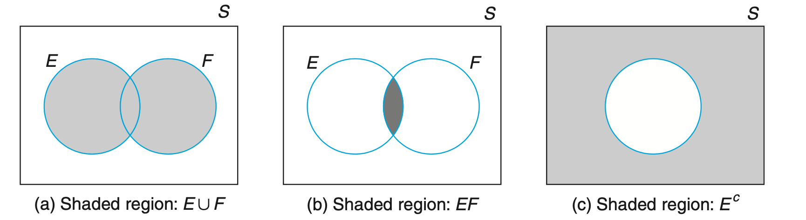
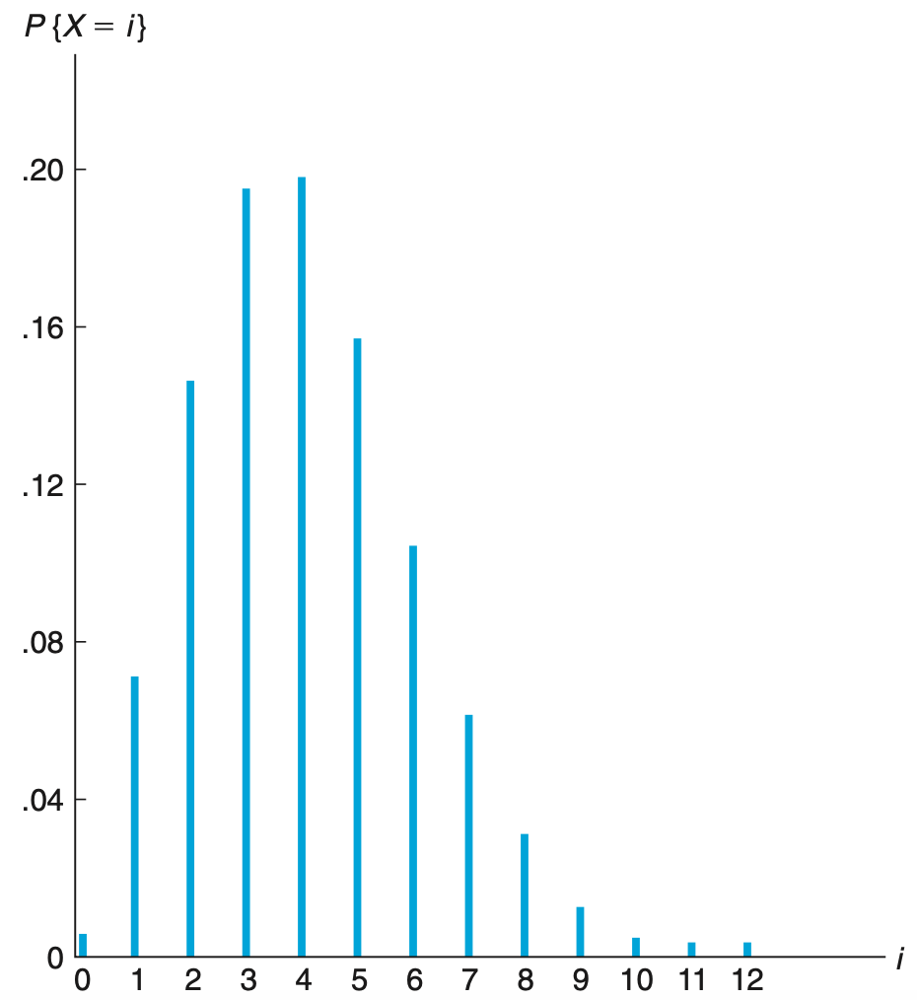

# 00 Mathematical Foundation

## Table of Contents

- [Overview](#overview)
- [Linear Algebra](#linear-algebra)
- [Probability Fundamentals](#probability-fundamentals)
- [Random Variables](#random-variables)
- [Important Distributions](#important-distributions)
- [Statistical Inference](#statistical-inference)
- [Parameter Estimation](#parameter-estimation)
- [Hypothesis Testing](#hypothesis-testing)
- [Linear Regression](#linear-regression)
- [Multivariate Normal Distribution](#multivariate-normal-distribution)
- [Key Concepts for Machine Learning](#key-concepts-for-machine-learning)
- [References](#references)

## Overview

This document covers essential mathematical and statistical foundations for understanding machine learning algorithms. Topics include linear algebra, probability theory, random variables, statistical distributions, and basic inference methods.

## Linear Algebra

Linear algebra is fundamental to machine learning, as most ML algorithms operate on vectors and matrices.

### Vectors

**Vector**: An ordered array of numbers representing a point or direction in space.

**Column vector**:
$$
\mathbf{x}=\begin{bmatrix}x_1\\x_2\\\vdots\\x_n\end{bmatrix}
$$

**Operations:**
- **Addition**: $\mathbf{x}+\mathbf{y}=\begin{bmatrix}x_1+y_1\\x_2+y_2\\\vdots\\x_n+y_n\end{bmatrix}$
- **Scalar multiplication**: $c\mathbf{x}=\begin{bmatrix}cx_1\\cx_2\\\vdots\\cx_n\end{bmatrix}$
- **Dot product**: $\mathbf{x}^T\mathbf{y}=\sum_{i=1}^nx_iy_i$
- **Norm**: $\|\mathbf{x}\|_2=\sqrt{\sum_{i=1}^nx_i^2}$ (Euclidean norm)

### Matrices

**Matrix**: A 2D array of numbers with m rows and n columns.

$$
\mathbf{A}=\begin{bmatrix}
a_{11} & a_{12} & \cdots & a_{1n}\\
a_{21} & a_{22} & \cdots & a_{2n}\\
\vdots & \vdots & \ddots & \vdots\\
a_{m1} & a_{m2} & \cdots & a_{mn}
\end{bmatrix}
$$

**Operations:**
- **Addition**: $(\mathbf{A}+\mathbf{B})_{ij}=a_{ij}+b_{ij}$
- **Scalar multiplication**: $(c\mathbf{A})_{ij}=ca_{ij}$
- **Matrix multiplication**: $(\mathbf{AB})_{ik}=\sum_{j=1}^na_{ij}b_{jk}$
- **Transpose**: $(\mathbf{A}^T)_{ij}=a_{ji}$

**Properties:**
- Matrix multiplication is associative: $(\mathbf{AB})\mathbf{C}=\mathbf{A}(\mathbf{BC})$
- Matrix multiplication is distributive: $\mathbf{A}(\mathbf{B}+\mathbf{C})=\mathbf{AB}+\mathbf{AC}$
- Matrix multiplication is not commutative: $\mathbf{AB}\neq\mathbf{BA}$ (in general)
- $(\mathbf{AB})^T=\mathbf{B}^T\mathbf{A}^T$

### Special Matrices

**Identity matrix** (I):
$$
\mathbf{I}=\begin{bmatrix}
1 & 0 & \cdots & 0\\
0 & 1 & \cdots & 0\\
\vdots & \vdots & \ddots & \vdots\\
0 & 0 & \cdots & 1
\end{bmatrix}
$$

Property: $\mathbf{AI}=\mathbf{IA}=\mathbf{A}$

**Diagonal matrix**: All off-diagonal elements are zero
$$
\mathbf{D}=\begin{bmatrix}
d_1 & 0 & \cdots & 0\\
0 & d_2 & \cdots & 0\\
\vdots & \vdots & \ddots & \vdots\\
0 & 0 & \cdots & d_n
\end{bmatrix}
$$

**Symmetric matrix**: $\mathbf{A}=\mathbf{A}^T$

**Orthogonal matrix**: $\mathbf{Q}^T\mathbf{Q}=\mathbf{QQ}^T=\mathbf{I}$

### Matrix Inverse

For square matrix $\mathbf{A}$, if it exists, the inverse $\mathbf{A}^{-1}$ satisfies:
$$
\mathbf{A}\mathbf{A}^{-1}=\mathbf{A}^{-1}\mathbf{A}=\mathbf{I}
$$

**Properties:**
- $(\mathbf{A}^{-1})^{-1}=\mathbf{A}$
- $(\mathbf{AB})^{-1}=\mathbf{B}^{-1}\mathbf{A}^{-1}$
- $(\mathbf{A}^T)^{-1}=(\mathbf{A}^{-1})^T$

A matrix is **invertible** (non-singular) if its determinant is non-zero.

### Determinant

For 2×2 matrix:
$$
\det\begin{bmatrix}a & b\\c & d\end{bmatrix}=ad-bc
$$

**Properties:**
- $\det(\mathbf{AB})=\det(\mathbf{A})\det(\mathbf{B})$
- $\det(\mathbf{A}^T)=\det(\mathbf{A})$
- $\det(\mathbf{A}^{-1})=\frac{1}{\det(\mathbf{A})}$

### Trace

The trace of a square matrix is the sum of diagonal elements:
$$
\text{tr}(\mathbf{A})=\sum_{i=1}^na_{ii}
$$

**Properties:**
- $\text{tr}(\mathbf{A}+\mathbf{B})=\text{tr}(\mathbf{A})+\text{tr}(\mathbf{B})$
- $\text{tr}(c\mathbf{A})=c\cdot\text{tr}(\mathbf{A})$
- $\text{tr}(\mathbf{AB})=\text{tr}(\mathbf{BA})$

### Eigenvalues and Eigenvectors

For square matrix $\mathbf{A}$, if there exists scalar $\lambda$ and non-zero vector $\mathbf{v}$ such that:
$$
\mathbf{A}\mathbf{v}=\lambda\mathbf{v}
$$

Then $\lambda$ is an **eigenvalue** and $\mathbf{v}$ is an **eigenvector**.

**Characteristic equation:**
$$
\det(\mathbf{A}-\lambda\mathbf{I})=0
$$

**Properties:**
- Sum of eigenvalues = trace of matrix
- Product of eigenvalues = determinant of matrix
- Symmetric matrices have real eigenvalues and orthogonal eigenvectors

**Eigendecomposition** (for square matrix):
$$
\mathbf{A}=\mathbf{Q}\Lambda\mathbf{Q}^{-1}
$$

where $\mathbf{Q}$ contains eigenvectors and $\Lambda$ is diagonal matrix of eigenvalues.

For symmetric matrix: $\mathbf{A}=\mathbf{Q}\Lambda\mathbf{Q}^T$ (spectral theorem)

### Singular Value Decomposition (SVD)

Any matrix $\mathbf{A}$ (m×n) can be decomposed as:
$$
\mathbf{A}=\mathbf{U}\Sigma\mathbf{V}^T
$$

where:
- $\mathbf{U}$ (m×m): left singular vectors (orthogonal)
- $\Sigma$ (m×n): diagonal matrix with singular values $\sigma_1\geq\sigma_2\geq\cdots\geq0$
- $\mathbf{V}$ (n×n): right singular vectors (orthogonal)

**Applications in ML:**
- Principal Component Analysis (PCA)
- Matrix approximation
- Dimensionality reduction
- Recommender systems

### Matrix Rank

The **rank** of a matrix is the maximum number of linearly independent rows (or columns).

**Properties:**
- $\text{rank}(\mathbf{A})\leq\min(m,n)$ for m×n matrix
- $\text{rank}(\mathbf{AB})\leq\min(\text{rank}(\mathbf{A}),\text{rank}(\mathbf{B}))$
- **Full rank**: rank equals the smallest dimension

### Vector Spaces

**Linear independence**: Vectors $\mathbf{v}_1,\mathbf{v}_2,...,\mathbf{v}_k$ are linearly independent if:
$$
c_1\mathbf{v}_1+c_2\mathbf{v}_2+\cdots+c_k\mathbf{v}_k=\mathbf{0} \implies c_1=c_2=\cdots=c_k=0
$$

**Span**: The set of all possible linear combinations of a set of vectors.

**Basis**: A set of linearly independent vectors that span a vector space.

**Dimension**: The number of vectors in a basis.

### Matrix Calculus

**Gradient** of scalar function with respect to vector:
$$
\nabla_{\mathbf{x}}f(\mathbf{x})=\begin{bmatrix}\frac{\partial f}{\partial x_1}\\\frac{\partial f}{\partial x_2}\\\vdots\\\frac{\partial f}{\partial x_n}\end{bmatrix}
$$

**Useful derivatives:**
- $\nabla_{\mathbf{x}}(\mathbf{a}^T\mathbf{x})=\mathbf{a}$
- $\nabla_{\mathbf{x}}(\mathbf{x}^T\mathbf{A}\mathbf{x})=(\mathbf{A}+\mathbf{A}^T)\mathbf{x}$
- $\nabla_{\mathbf{x}}(\mathbf{x}^T\mathbf{x})=2\mathbf{x}$

**Hessian** (matrix of second derivatives):
$$
\mathbf{H}_{ij}=\frac{\partial^2f}{\partial x_i\partial x_j}
$$

### Norms

**Vector norms:**
- $L^1$ norm: $\|\mathbf{x}\|_1=\sum_{i=1}^n|x_i|$
- $L^2$ norm (Euclidean): $\|\mathbf{x}\|_2=\sqrt{\sum_{i=1}^nx_i^2}$
- $L^\infty$ norm: $\|\mathbf{x}\|_\infty=\max_i|x_i|$

**Matrix norms:**
- Frobenius norm: $\|\mathbf{A}\|_F=\sqrt{\sum_{i=1}^m\sum_{j=1}^na_{ij}^2}$

### Positive Definite Matrices

A symmetric matrix $\mathbf{A}$ is **positive definite** if:
$$
\mathbf{x}^T\mathbf{A}\mathbf{x}>0 \quad \text{for all non-zero } \mathbf{x}
$$

**Properties:**
- All eigenvalues are positive
- Invertible
- Important for optimization (convex functions)

**Positive semi-definite**: $\mathbf{x}^T\mathbf{A}\mathbf{x}\geq0$

### Linear Systems and Least Squares

**Linear system**: $\mathbf{Ax}=\mathbf{b}$

**Least squares solution** (when system is overdetermined):
$$
\hat{\mathbf{x}}=\arg\min_{\mathbf{x}}\|\mathbf{Ax}-\mathbf{b}\|_2^2
$$

**Normal equations:**
$$
\mathbf{A}^T\mathbf{Ax}=\mathbf{A}^T\mathbf{b}
$$

**Solution:**
$$
\hat{\mathbf{x}}=(\mathbf{A}^T\mathbf{A})^{-1}\mathbf{A}^T\mathbf{b}
$$

The matrix $(\mathbf{A}^T\mathbf{A})^{-1}\mathbf{A}^T$ is called the **pseudo-inverse**.

## Probability Fundamentals

### Sample Space and Events

- **Sample space**: set of all possible outcomes of an experiment
- **Event**: any subset of the sample space
- **Set operations**:
  - Intersection: $E \cap F$
  - Union: $E \cup F$
  - Complement: $E^c$
  - Mutually exclusive: $E \cap F=\phi$

### Conditional Probability

- General formula:

$$
P(E|F)=\frac{P(EF)}{P(F)}
$$

- Bayes formula:

$$
P(F_j|E)=\frac{P(E|F_j)P(F_j)}{\sum_{i=1}^nP(E|F_i)P(F_i)}
$$

### Independence

Two events E and F are independent if:
$$
P(EF)=P(E)P(F)
$$

## Random Variables

### Basic Concepts

- **Random variable**: quantity of interest determined by the result of an experiment
- **Discrete random variables**: countable set of possible values
- **Continuous random variables**: continuum of possible values
- **Cumulative distribution function**: $F(x)=P(X\le x)$
- **Probability mass function** (discrete): $p(a)=P(X=a)$
- **Probability density function** (continuous): $F(a)=\int_{-\infty}^af(x)dx$

### Expectation and Variance

**Expectation:**
- Discrete: $E[X]=\sum_{i=1}^n x_ip(x_i)$
- Continuous: $E[X]=\int xf(x)dx$
- Linearity: $E[X+Y]=E[X]+E[Y]$

**Variance:**
$$
Var(X)=E[(X-\mu)^2]=E[X^2]-E[X]^2
$$

$$
Var(aX+b)=a^2Var(X)
$$

### Covariance and Correlation

**Covariance:**
$$
Cov(X, Y)=E[(X-\mu_x)(Y-\mu_y)]=E[XY]-E[X]E[Y]
$$

**Correlation:**
$$
Corr(X,Y)=\frac{Cov(X,Y)}{\sqrt{Var(X)Var(Y)}}
$$

**Properties:**
- $Var(X+Y)=Var(X)+Var(Y)+2Cov(X, Y)$
- Independent random variables: $Cov(X,Y)=0$

## Important Distributions

### Bernoulli Distribution

Binary outcome (success/failure):
$$
P(x=1)=p, \quad P(x=0)=1-p
$$

$$
E[X]=p, \quad Var(X)=p(1-p)
$$

### Binomial Distribution

Number of successes in *n* independent Bernoulli trials:
$$
P(X=k)=C_n^kp^k(1-p)^{n-k}
$$

$$
E[X]=np, \quad Var(X)=np(1-p)
$$

### Poisson Distribution

Events occurring in a fixed interval:
$$
P(X=k)=e^{-\lambda}\frac{\lambda^k}{k!}
$$

$$
E[X]=\lambda, \quad Var(X)=\lambda
$$

### Uniform Distribution

$$
f(x)=\frac{1}{\beta-\alpha},\ \text{if}\ \alpha\le x \le \beta
$$

$$
E[X]=\frac{\alpha+\beta}{2}, \quad Var(X)=\frac{(\beta-\alpha)^2}{12}
$$

### Normal (Gaussian) Distribution

$$
f(x)=\frac{1}{\sqrt{2\pi}\sigma}e^{-(x-\mu)^2/2\sigma ^2}
$$

**Standard Normal:** $\mu=0, \sigma=1$

### Exponential Distribution

Time between events in a Poisson process:
$$
f(x)=\lambda e^{-\lambda x}, \ \text{if}\ x\ge0
$$

$$
E[X]=\frac{1}{\lambda}, \quad Var(X)=\frac{1}{\lambda^2}
$$

**Memoryless property:** $P(X>s+t|X>t)=P(X>s)$

## Statistical Inference

### Law of Large Numbers

For i.i.d. random variables $X_1,X_2,...,X_n$ with mean $\mu$ and finite variance:
$$
\bar X_n=\frac{1}{n}\sum_{i=1}^nX_i\stackrel{p}{\longrightarrow}\mu
$$

### Central Limit Theorem

For i.i.d. random variables with mean $\mu$ and variance $\sigma^2$:
$$
\sqrt n\frac{\bar X_n-\mu}{\sigma}\stackrel{d}{\longrightarrow}N(0,1)
$$

The sample mean of a large sample (typically n ≥ 30) is approximately normally distributed, regardless of the underlying distribution.

### Sample Statistics

- **Sample mean**: $\bar X=\frac{X_1+...+X_n}{n}$
- **Sample variance**: $s^2=\frac{1}{n-1}\sum_{i=1}^n(x_i-\bar x)^2$
- **Sample standard deviation**: $s=\sqrt{s^2}$

**Properties:**
- $E[\bar X]=\mu$
- $Var(\bar X)=\frac{\sigma^2}{n}$

## Parameter Estimation

### Maximum Likelihood Estimation (MLE)

Given i.i.d. sample $X_1,...,X_n$ with density $f(x;\theta)$:

**Likelihood function:**
$$
L(\theta;x_1,...,x_n)=\prod_{i=1}^nf(x_i;\theta)
$$

**MLE:**
$$
\hat \theta_{MLE}=\arg\max_{\theta}\log L(\theta;X_1,...X_n)
$$

**Properties:**
- Consistent: $\hat \theta_n\stackrel{p}{\longrightarrow}\theta_0$
- Asymptotically normal: $\sqrt n(\hat \theta_n-\theta_0)\stackrel{d}{\longrightarrow}N(0,I(\theta_0)^{-1})$

**Examples:**
- Normal distribution: $\hat\mu = \bar X$, $\hat\sigma^2=\frac{1}{n}\sum_{i=1}^n (X_i-\bar X)^2$
- Uniform distribution: $\hat \theta=\max(X_1, X_2, ..., X_n)$

### Confidence Intervals

A $(1-\alpha)$ confidence interval for parameter $\theta$ satisfies:
$$
P[L(\mathbf{X})\le\theta\le U(\mathbf{X})]\ge 1-\alpha
$$

**Common confidence intervals:**

- **Normal mean (known variance)**: $\bar X \pm z_{\alpha/2}\frac{\sigma}{\sqrt{n}}$
- **Normal mean (unknown variance)**: $\bar X \pm t_{\alpha/2,n-1}\frac{s}{\sqrt{n}}$

## Hypothesis Testing

### Basic Concepts

- **Null hypothesis (H₀)**: default hypothesis to be tested
- **Alternative hypothesis (H₁)**: competing hypothesis
- **Type I error**: rejecting H₀ when it is true (significance level α)
- **Type II error**: accepting H₀ when it is false (power = 1 - β)
- **p-value**: probability of observing the data (or more extreme) under H₀

**Decision rule:**
- If p-value < α: reject H₀
- If p-value ≥ α: fail to reject H₀

### Common Tests

**Mean of a normal population (known variance):**
$$
z=\frac{\bar X-\mu_0}{\sigma/\sqrt n}
$$

**Mean of a normal population (unknown variance):**
$$
t=\frac{\bar X-\mu_0}{s/\sqrt n} \sim t_{n-1}
$$

## Linear Regression

### Simple Linear Regression

Model: $Y_i=\beta_0+\beta_1x_i+\epsilon_i$

**Least squares estimates:**
$$
\hat\beta_1=\frac{\sum(x_i-\bar x)(Y_i-\bar Y)}{\sum(x_i-\bar x)^2}
$$

$$
\hat\beta_0=\bar Y-\hat\beta_1\bar x
$$

**Coefficient of determination:**
$$
R^2=1-\frac{SS_{residual}}{SS_{total}}
$$

$R^2$ measures the proportion of variance in Y explained by X.

### Multiple Linear Regression

Matrix form: $\mathbf{Y}=\mathbf{X}\beta+\epsilon$

**Least squares solution:**
$$
\hat{\beta}=(\mathbf{X}^T\mathbf{X})^{-1}\mathbf{X}^T\mathbf{Y}
$$

**Properties:**
- Unbiased: $E[\hat\beta]=\beta$
- Variance: $Var(\hat\beta)=\sigma^2(\mathbf{X}^T\mathbf{X})^{-1}$

## Multivariate Normal Distribution

**Density function:**
$$
f(\mathbf{x};\mu,\Sigma)=\frac{1}{(2\pi)^{d/2}|\Sigma|^{1/2}}\exp\left(-\frac{1}{2}(\mathbf{x}-\mu)^T\Sigma^{-1}(\mathbf{x}-\mu)\right)
$$

**MLE estimates:**
$$
\hat\mu=\bar{\mathbf{X}}_n=\frac{1}{n}\sum_{i=1}^n\mathbf{X}_i
$$

$$
\hat\Sigma=\frac{1}{n}\sum_{i=1}^n (\mathbf{X}_i - \bar{\mathbf{X}}_n)(\mathbf{X}_i - \bar{\mathbf{X}}_n)^T
$$

**Central Limit Theorem:**
$$
\sqrt n(\bar X_n-\mu)\stackrel{D}{\longrightarrow}N(0,\Sigma)
$$

## Key Concepts for Machine Learning

### Bias-Variance Trade-off

Model error can be decomposed as:
$$
E[(f(\mathbf{x})-\hat{f}(\mathbf{x}))^2]=\text{Bias}^2[\hat{f}(\mathbf{x})]+\text{Var}[\hat{f}(\mathbf{x})]+\sigma^2
$$

- **Bias**: error from incorrect assumptions
- **Variance**: error from sensitivity to training data
- **Irreducible error**: inherent noise in data

### Regularization

**L1 Regularization (Lasso):**
$$
\min_\beta \left\|\mathbf{y}-\mathbf{X}\beta\right\|_2^2 + \lambda\|\beta\|_1
$$

**L2 Regularization (Ridge):**
$$
\min_\beta \left\|\mathbf{y}-\mathbf{X}\beta\right\|_2^2 + \lambda\|\beta\|_2^2
$$

### Information Theory Basics

**Entropy:**
$$
H(X)=-\sum_x p(x)\log p(x)
$$

**Cross-Entropy:**
$$
H(p,q)=-\sum_x p(x)\log q(x)
$$

**KL Divergence:**
$$
D_{KL}(p||q)=\sum_x p(x)\log\frac{p(x)}{q(x)}
$$

## References

**Course Materials:**
- STAT GR5701 Probability and Statistics for Data Science - Columbia University
- STAT GR5703 Statistical Inference and Modeling - Columbia University
