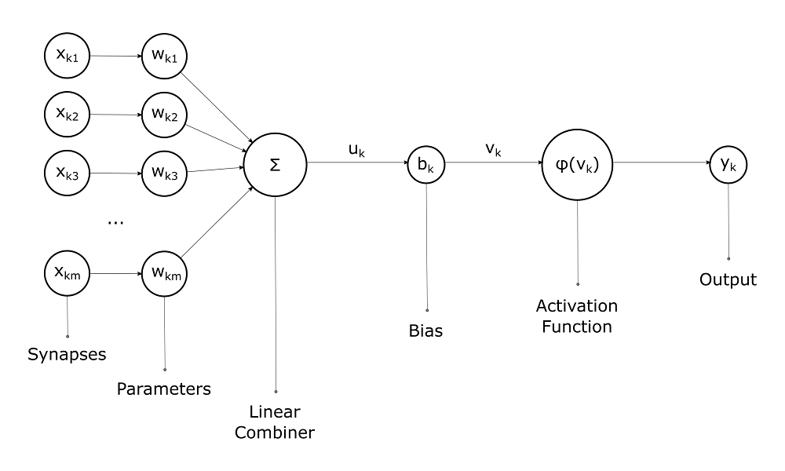
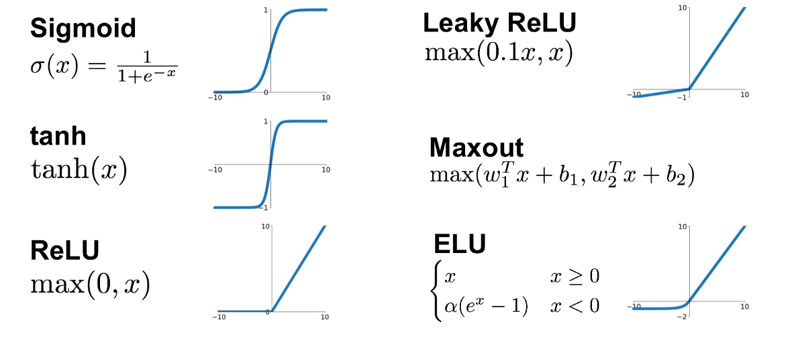
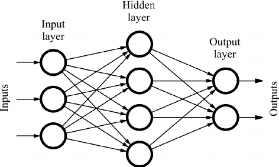
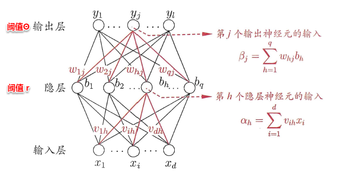
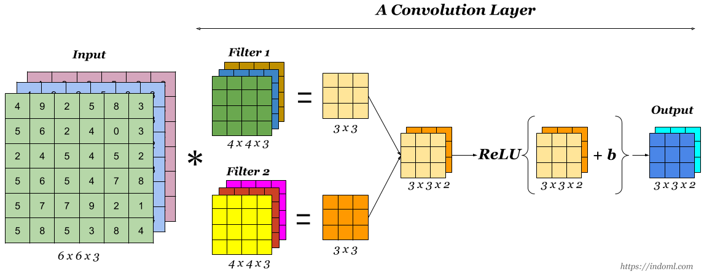
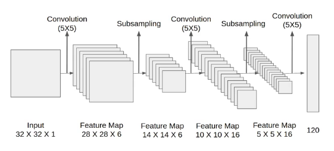
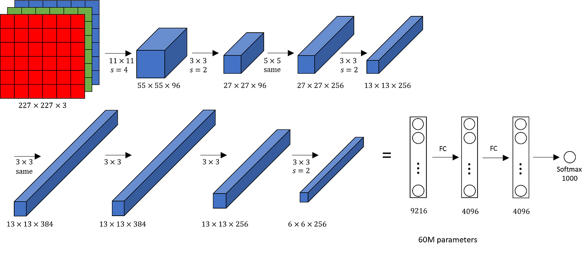
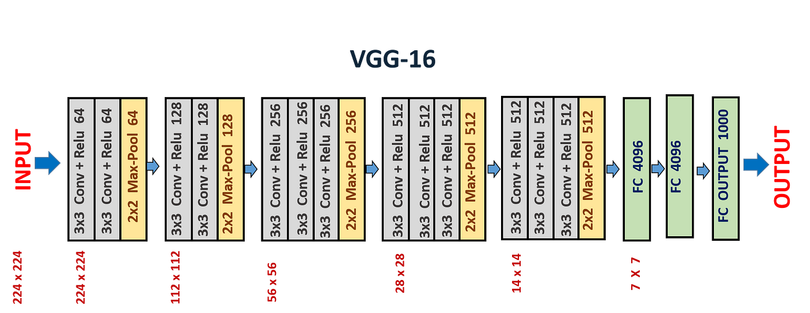

# 02 Deep Learning

## Table of Contents

- [Overview](#overview)
- [Fundamental Concepts](#fundamental-concepts)
- [Artificial Neural Networks](#artificial-neural-networks)
- [Practical Aspects of Deep Learning](#practical-aspects-of-deep-learning)
- [Regularization Techniques](#regularization-techniques)
- [Machine Learning Strategy](#machine-learning-strategy)
- [Convolutional Neural Networks](#convolutional-neural-networks)
- [Object Detection](#object-detection)
- [Special Applications](#special-applications)
- [Recurrent Neural Networks](#recurrent-neural-networks)
- [Sequence Models](#sequence-models)
- [Generative Models](#generative-models)
- [References](#references)

## Overview

Deep learning is a subset of machine learning based on artificial neural networks with multiple layers. These deep architectures learn hierarchical representations of data, enabling breakthroughs in computer vision, natural language processing, speech recognition, and many other domains.

### Factors Driving Deep Learning Success

Deep learning's recent success is attributed to three primary factors:

**Data:**

The proliferation of digital devices and the internet has led to an explosion in available data. The performance of deep learning models, especially large ones, scales significantly with the amount of training data, often surpassing traditional machine learning algorithms on massive datasets.

**Computation:**

The development of powerful GPUs, which are highly effective at parallel computation, has made it feasible to train large networks that were previously computationally intractable. Vectorization—replacing explicit loops with matrix operations—is critical for leveraging hardware efficiency.

**Algorithms:**

Innovations in algorithms have been critical. For instance, the switch from sigmoid to the Rectified Linear Unit (ReLU) activation function significantly accelerated training by mitigating the vanishing gradient problem. ReLU helps with faster convergence and is computationally efficient.

## Fundamental Concepts

- **Neural Networks**: At the core of deep learning are artificial neural networks, which consist of neurons (nodes) arranged in layers. A typical network comprises an input layer, multiple hidden layers, and an output layer.
- **Learning Process**: Neural networks learn by adjusting weights and biases within their neurons. This process is typically achieved through backpropagation, where the network adjusts its parameters based on the error of its predictions.
- **Convolutional Neural Networks (CNNs)**: Specialized for processing structured grid data such as images, CNNs use convolutional layers to efficiently recognize spatial hierarchies in data.
- **Recurrent Neural Networks (RNNs)**: Designed for sequential data (e.g., time series or text), RNNs have the unique feature of using their internal state (memory) to process sequences of inputs.
- **Deep Learning Frameworks**: Tools such as TensorFlow, PyTorch, and Keras simplify the development of deep learning models by providing libraries for creating and training neural networks.

## Artificial Neural Networks

### Neurons

- **Inputs (x₁, x₂, ..., xn)**: Each neuron receives multiple inputs. These inputs can be raw data or outputs from other neurons.
- **Weights (w₁, w₂, ..., wn)**: Each input is assigned a weight that represents its importance. The neural network learns by updating these weights.
- **Bias (b)**: A bias term is added to the input-weight product, allowing the neuron to adjust the output along the activation function independently of its inputs.
- **Activation Function**: This function is applied to the weighted sum of the inputs plus the bias. It determines whether a neuron should be activated or not, influencing the neuron's output.
  - **Sigmoid**: Maps the input to a value between 0 and 1, useful for binary classification.
  - **ReLU (Rectified Linear Unit)**: Outputs the input if it's positive; otherwise, it outputs zero. It's widely used for its computational efficiency and because it allows models to learn fast and effectively.
  - **Tanh (Hyperbolic Tangent)**: Similar to the sigmoid but maps the input to values between -1 and 1, making it more suitable for certain types of normalized data.

### Feedforward Network

- **Input Layer**: The first layer that receives the input signal to be processed. Each neuron in the input layer represents a feature of the input data.
- **Hidden Layers**: One or more layers that perform computations with signals received from the previous layer. Each neuron in these layers applies a weighted sum on its inputs, adds a bias, and then passes the result through an activation function.
- **Output Layer**: The final layer that produces the network's output. For classification tasks, this layer often uses a softmax activation function to output probabilities corresponding to each class.

### Backpropagation

1. **Initialize Weights**: Randomly initialize the network's weights.
2. **Perform a Forward Pass**: Compute the output of the network and the loss.
3. **Compute Gradients (Backward Pass)**: Use the chain rule to calculate the gradients of the loss function with respect to each weight.
4. **Update Weights**: Adjust the weights by a fraction (defined by the learning rate) of their gradients.
5. **Repeat**: Perform multiple iterations of forward and backward passes with weight updates until the network's performance is satisfactory or a certain number of iterations is reached.

$$
E_k=\frac{1}{2}\sum_j^l(\hat y_j^k-y_j^k)^2
$$

$$
\frac{\partial E_k}{\partial v_{ih}}=\sum_j^l\frac{\partial E_k}{\partial \hat y_j^k}\cdot \frac{\partial \hat y_j^k}{\partial \beta_j}\cdot \frac{\partial \beta_j}{\partial b_h}\cdot \frac{\partial b_h}{\partial \alpha_h}\cdot \frac{\partial \alpha_h}{\partial v_{ih}}
$$

$$
\frac{\partial E_k}{\partial v_{ih}}=\sum_j^l(\hat y_j^k-y_j^k)\hat y_j^k(1-\hat y_j^k)w_{hj}b_h(1-b_h)x_i=\sum_j^l-g_jw_{hj}b_h(1-b_h)x_i
$$

$$
\frac{\partial E_k}{\partial v_{ih}}=-b_h(1-b_h)\sum_j^lg_jw_{hj}x_i=-e_hx_i
$$

### Loss Functions

- Regression: Mean Squared Error (MSE) computes the average of the squares of the errors between the actual values ($y$) and the predicted values ($\hat{y}$). It's widely used in regression problems.

$$
MSE=\frac{1}{n}\sum_{i=1}^{n}(y_i-\hat{y_i})^2
$$

- Classification: Cross-entropy loss measures the performance of a classification model whose output is a probability value between 0 and 1. Often used in conjunction with the softmax function in the output layer for multiclass classification problems.

$$
Cross-Entropy=-\sum_{i=1}^n\sum_{c=1}^My_{ic}log(\hat{y_{ic}})
$$

### Optimization

- Batch Gradient Descent: BGD computes the gradient of the loss function with respect to the parameters (\(\theta\)) for the entire training dataset.

  - **Update Rule**: $\theta = \theta - \eta \nabla_\theta J(\theta)$, where $\eta$ is the learning rate, and $J(\theta)$ is the cost function computed over the whole dataset.

  - **Accuracy**: Provides accurate updates as it considers the entire dataset.

  - **Speed**: Can be very slow with large datasets because it requires the entire dataset to be in memory and processes it all at once.

  - **Convergence**: Guaranteed to converge to the global minimum for convex error surfaces and to a local minimum for non-convex surfaces.

- Stochastic Gradient Descent: SGD updates the parameters for each training example one by one.

  - **Update Rule**: $\theta = \theta - \eta \nabla_\theta J(\theta; x^{(i)}, y^{(i)})$, where $x^{(i)}, y^{(i)}$ is a single training example.

  - **Speed**: Much faster per iteration than BGD because it updates the weights after each training example.

  - **Noise**: Updates are noisy (high variance), which can help escape local minima but may also prevent convergence to the exact minimum.

  - **Convergence**: The noisiness means it may never "settle" into a minimum but can oscillate in a small region, providing a good approximation.

- Mini-Batch Gradient Descent: MGD divides the training dataset into small batches and updates the model's parameters for each batch.

  - **Update Rule**: $\theta = \theta - \eta \nabla_\theta J(\theta; X_{\text{mini-batch}}, Y_{\text{mini-batch}})$, where $X_{\text{mini-batch}}, Y_{\text{mini-batch}}$ is a subset of the training data.

  - **Balance**: Strikes a balance between the efficiency of SGD and the stability of BGD.

  - **Speed**: Faster than BGD because it processes batches of the dataset at a time, which can be efficiently parallelized on modern hardware.

  - **Convergence**: More stable convergence than SGD but with some of the benefits of noise, helping to escape local minima.

- **Gradient descent with Momentum:** Accelerates SGD in the relevant direction and dampens oscillations, improving convergence speed

$$
v_{dW^{[l]}} = \beta v_{dW^{[l]}} + (1 - \beta) dW^{[l]}
$$

$$
v_{db^{[l]}} = \beta v_{db^{[l]}} + (1 - \beta) db^{[l]}
$$

$$
W^{[l]} := W^{[l]} - \alpha v_{dW^{[l]}}
$$

$$
b^{[l]} := b^{[l]} - \alpha v_{db^{[l]}}
$$

- **Adagrad (Adaptive Gradient Problem):** Adapts the learning rate to the parameters, performing smaller updates for parameters associated with frequently occurring features, and larger updates for parameters associated with infrequent features.

$$
s_{dw} = s_{dw} + (dw)^2
$$

$$
s_{db} = s_{db} + (db)^2
$$

$$
w := w - \frac{\alpha}{\sqrt{s_{dw} + \epsilon}}dw
$$

$$
b := b - \frac{\alpha}{\sqrt{s_{db} + \epsilon}}db
$$

- **RMSprop (Root Mean Square Propagation): **Addresses AdaGrad's radically diminishing learning rates by using a moving average of squared gradients to normalize the gradient. This ensures the learning rate doesn't decrease too quickly.

$$
s_{dw} = \beta s_{dw} + (1 - \beta)(dw)^2
$$

$$
s_{db} = \beta s_{db} + (1 - \beta)(db)^2
$$

$$
w := w - \frac{\alpha}{\sqrt{s_{dw} + \epsilon}}dw
$$

$$
b := b - \frac{\alpha}{\sqrt{s_{db} + \epsilon}}db
$$

- **Adam (Adaptive Moment Estimation): **Combines ideas from RMSprop and SGD with momentum by keeping an exponentially decaying average of past gradients and squared gradients. It adjusts the learning rate for each weight individually.

$$
v_{dW} = \beta_1 v_{dW} + (1 - \beta_1) dW
$$

$$
v_{db} = \beta_1 v_{db} + (1 - \beta_1) db
$$

$$
s_{dW} = \beta_2 s_{dW} + (1 - \beta_2) {(dW)}^2
$$

$$
s_{db} = \beta_2 s_{db} + (1 - \beta_2) {(db)}^2
$$

$$
v^{corrected}_{dW} = \frac{v_{dW}}{1-{\beta_1}^t}
$$

$$
v^{corrected}_{db} = \frac{v_{db}}{1-{\beta_1}^t}
$$

$$
s^{corrected}_{dW} = \frac{s_{dW}}{1-{\beta_2}^t}
$$

$$
s^{corrected}_{db} = \frac{s_{db}}{1-{\beta_2}^t}
$$

$$
W := W - \frac{\alpha}{{\sqrt{s^{corrected}_{dW}} + \epsilon}}v^{corrected}_{dW}
$$

## Practical Aspects of Deep Learning

### Data Splitting and Bias/Variance

The typical machine learning workflow is an iterative loop: Idea → Code → Experiment. To guide this process, data is split into three sets:

**Training Set:**

Used to train the model's parameters (weights and biases).

**Development (Dev) Set:**

Used to tune hyperparameters and evaluate different models. Also known as the hold-out cross-validation set.

**Test Set:**

Used for final, unbiased evaluation of the trained model.

**Modern Splitting Ratios:**

For large datasets (>1 million examples), common ratios are 98% train / 1% dev / 1% test. It is critical that the dev and test sets come from the same distribution, reflecting the data the model is expected to see in production.

### Bias-Variance Tradeoff

The bias-variance tradeoff is central to diagnosing model performance:

**High Bias (Underfitting):**
- Model fails to fit training data well
- Example: Train error 15%, Dev error 16%
- Both training and test errors are high

**High Variance (Overfitting):**
- Model fits training data well but doesn't generalize
- Example: Train error 1%, Dev error 11%
- Low training error, high test error

**High Bias and High Variance:**
- Model fits neither training nor dev set well
- Example: Train error 15%, Dev error 30%

### Basic Recipe for Machine Learning

1. **Address High Bias:**
   - Train a bigger network
   - Train longer
   - Try advanced optimization algorithms

2. **Address High Variance:**
   - Get more training data
   - Apply regularization
   - Try different network architecture

## Regularization Techniques

Regularization methods prevent overfitting and reduce variance.

### L2 Regularization (Weight Decay)

Adds a penalty term to the cost function:
$$
J_{reg}(W,b) = J(W,b) + \frac{\lambda}{2m}\sum_l\|W^{[l]}\|_F^2
$$

**Effect:**

Encourages smaller weights, leading to smoother, less complex models. The weight update rule becomes:
$$
dW^{[l]} = (\text{from backprop}) + \frac{\lambda}{m}W^{[l]}
$$

This causes weights to "decay" towards zero during training.

### Dropout Regularization

During each training iteration, neurons are randomly "dropped out" (deactivated) with probability $(1 - \text{keep\_prob})$.

**Inverted Dropout:**

Activations are scaled by $1/\text{keep\_prob}$ during training to maintain expected values:
$$
A^{[l]} = A^{[l]} / \text{keep\_prob}
$$

**Benefits:**
- Prevents units from co-adapting too much
- Forces network to learn more robust features
- Not used during testing

### Data Augmentation

Artificially increases training set size by creating modified copies:
- Image transformations: flipping, rotating, cropping
- Color adjustments
- Adding noise

**Effect:**

Helps model generalize better to new, unseen data without collecting more data.

### Early Stopping

Monitor dev set error during training and stop when it begins to increase, saving the model parameters from the point of lowest dev error.

**Tradeoff:**

Simple and effective but combines two concerns (optimizing cost function and preventing overfitting), which contradicts orthogonalization principle.

### Batch Normalization

Normalizes activations of a hidden layer (typically $Z^{[l]}$) to have zero mean and unit variance, followed by re-scaling:
$$
\tilde{z}^{(i)} = \gamma z^{(i)}_{norm} + \beta
$$

where $\gamma$ and $\beta$ are learnable parameters.

**Benefits:**
- Dramatically speeds up training
- Makes network more robust to weight initialization
- Provides slight regularization effect
- Enables higher learning rates

**At Test Time:**

Mean and variance are estimated using exponentially weighted averages computed during training.

## Machine Learning Strategy

### Orthogonalization

The principle of tuning one control to affect one specific outcome without impacting others.

**In Machine Learning:**

1. Fit training set well (addressing bias)
2. Fit dev set well (addressing variance)
3. Fit test set well (ensuring dev set wasn't overfit)
4. Perform well in real world (ensuring appropriate metric and data distribution)

### Evaluation Metrics

**Single Number Evaluation Metric:**

Having a single, real-valued metric (e.g., F1 score) allows for rapid and unambiguous evaluation of different models.

**Satisficing and Optimizing Metrics:**

- **Optimizing**: Primary metric to improve (e.g., maximize accuracy)
- **Satisficing**: Metrics that need to meet threshold (e.g., runtime < 100ms)

### Human-Level Performance

Serves as practical proxy for Bayes optimal error (theoretical minimum error).

**Avoidable Bias:**
$$
\text{Avoidable Bias} = \text{Training Error} - \text{Human-Level Error}
$$

Large gap indicates bias problem.

**Variance:**
$$
\text{Variance} = \text{Dev Error} - \text{Training Error}
$$

Large gap indicates variance problem.

**Progress Slowdown:**

Once model surpasses human-level performance, progress often slows as it becomes harder to identify sources of remaining error.

### Error Analysis

Manually examine sample of misclassified examples from dev set and categorize errors:
- Blurry images
- Mislabeled data
- Specific object types

**Benefits:**
- Reveals most frequent error types
- Provides "ceiling" on potential improvement
- Guides prioritization of next steps

## Convolutional Neural Networks

### Architecture

- **Convolutional Layer: **The convolutional layer is the core building block of a Convolutional Neural Network (CNN). Its primary function is to detect patterns such as edges, colors, textures, and complex shapes within the input images.
  - **Filters/Kernels**: A convolutional layer consists of several filters (or kernels) that are small but extend through the full depth of the input volume. For instance, in an RGB image, a filter would have a depth of 3, corresponding to the three color channels.
  - **Convolution Operation**: As a filter is slid (or convolved) across the input image, it performs element-wise multiplication with the part of the image it covers and sums up these multiplications. This process is repeated across the entire image, producing a feature map for each filter.
  - **Strides**: The stride determines how much the filter moves across the image. A stride of 1 moves the filter one pixel at a time, while a larger stride moves the filter more pixels, reducing the size of the output feature map.
  - **Padding**: To control the size of the feature maps, padding can be added to the input image. Zero-padding pads the input image with zeros around the border, allowing for control over the spatial size of the output volumes.
  - **Activation Function**: Typically, after a convolution operation, an activation function like ReLU (Rectified Linear Unit) is applied to introduce non-linearity, enabling the network to learn complex patterns.

- **Pooling Layer: **Pooling layers follow convolutional layers and are used to reduce the spatial dimensions (width and height) of the input volume for the next convolutional layer. This reduction in dimensionality means less computation and memory usage, as well as less chance of overfitting.
  - **Max Pooling**: The most common form of pooling, where the maximum element is selected from the region of the feature map covered by the filter, typically of size 2x2.
  - **Average Pooling**: Calculates the average of the elements in the region of the feature map covered by the filter.
  - **Global Pooling**: Reduces each feature map to a single value by taking the average or maximum of all elements in the feature map.

### LeNet

- **Input Layer**: The original LeNet-5 architecture accepts a 32×32 pixel grayscale image as input. This size is chosen to ensure that the handwritten digits fit well within the field of view of the convolutional layers.
- **Convolutional Layers**: The network uses convolutional layers with small filter sizes (e.g., 5×5) to learn spatial hierarchies of features from the input image. These layers apply a set of learnable filters to the input, creating a series of feature maps.
- **Activation Functions**: After each convolutional layer, an activation function, typically the sigmoid or tanh in the original LeNet-5 model, is applied to introduce non-linearity into the model, allowing it to learn more complex patterns.
- **Pooling (Subsampling) Layers**: LeNet uses average pooling layers (also known as subsampling) to reduce the spatial dimensions of the feature maps, thereby reducing the computational complexity and helping to make the representation more invariant to small translations of the input.
- **Fully Connected Layers**: Towards the end of the network, fully connected layers are used to perform high-level reasoning based on the features extracted by the convolutional and pooling layers. The final layer uses a softmax activation function to output a probability distribution over the target classes.
- **Output Layer**: Produces the final classification output, with each neuron corresponding to a class label (e.g., digits 0-9 in the case of handwritten digit recognition).

### AlexNet

- **Convolutional Layers: **These layers perform convolution operations, applying filters (or kernels) to the input images to extract features such as edges, textures, and other patterns. The filters are learned during the training process.

- **ReLU (Rectified Linear Unit) Layers: **Follows directly after each convolutional layer and introduces non-linearity into the model, allowing it to learn complex patterns.

- **Pooling (Max Pooling) Layers: **These layers are used to reduce the spatial dimensions (width and height) of the input volume for the next convolutional layer. It helps to decrease the computational load, memory usage, and also helps to prevent overfitting.

- **Normalization Layers (Local Response Normalization): ** This layer enhances the computed activity of neurons that are more strongly activated while suppressing weaker activations, making the network less sensitive to high-frequency features and improving generalization.

- **Fully Connected Layers: ** These layers are used to flatten the high-level features learned by convolutional layers and combine them to form a model. The output from the last fully connected layer is fed to a softmax classifier to obtain the final classification probabilities for each class.

- **Dropout Layers: **Introduced just before the first and the second fully connected layers, dropout is a regularization technique to prevent overfitting in the neural network.

- **Softmax Output Layer: **The final layer in AlexNet is a softmax layer that outputs a distribution over the 1000 class labels, converting the scores into probabilities.

### VGG

- **Convolutional Layers:** VGG networks use 3x3 convolutional filters with a stride of 1 pixel; this small receptive field allows capturing fine details in the image. The convolutional layers are arranged in blocks, with each block followed by a max-pooling layer for spatial downsampling.
- **Depth:** The networks are notably deep, with VGG-16 and VGG-19 having 16 and 19 layers respectively. This depth is crucial for learning a hierarchy of features at different scales and complexities.
- **Fully Connected Layers:** Following several blocks of convolutional and max-pooling layers, VGG networks have three fully connected layers. The first two have 4096 channels each, and the third performs classification, having as many channels as there are classes in the dataset (e.g., 1000 for ImageNet).
- **ReLU Activation:** The ReLU (Rectified Linear Unit) activation function is applied after each convolutional layer, introducing non-linearity into the model without affecting the receptive fields of the convolution layers.
- **Fixed Input Size:** VGG networks are trained with a fixed input size of 224x224 RGB images, which means that all images need to be resized to this dimension before being fed into the network.
- **Pre-training:** VGG networks were pre-trained on the ImageNet dataset, which contains over a million images categorized into 1000 classes. This pre-training helps in transferring learned features to other visual recognition tasks with less data.

### Classic CNN Architectures

**LeNet-5 (1998):**

An early, pioneering CNN for handwritten digit recognition (MNIST dataset).

**Key Features:**
- Uses convolutional and pooling layers
- Relatively small architecture
- Demonstrated feasibility of CNNs for image classification

**AlexNet (2012):**

A much larger network that won the ImageNet competition, convincing many researchers of deep learning's potential.

**Key Features:**
- Similar structure to LeNet-5 but much deeper
- Used ReLU activations instead of tanh/sigmoid
- Employed dropout for regularization
- Trained on GPUs
- 60 million parameters

**Impact:**

Triggered the deep learning revolution in computer vision.

### ResNet

ResNet (Residual Networks) introduced a revolutionary architecture that enables training of very deep neural networks.

- **Residual Blocks:** The core idea behind ResNet is its use of residual blocks. These blocks have a shortcut connection that skips one or more layers and performs identity mapping, adding the input of the block to its output. This design encourages the network to learn residual functions with reference to the layer inputs, making it easier to train deeper networks.
- **Deep Architectures:** ResNet architectures come in various depths, with ResNet-18, ResNet-34, ResNet-50, ResNet-101, and ResNet-152 being some of the most popular configurations. The number denotes the total layers in the architecture. The deeper versions of ResNet, like ResNet-50 and beyond, use "bottleneck" layers with 1x1, 3x3, and 1x1 convolutional layers in their residual blocks to increase depth without a significant increase in computational complexity.
- **Batch Normalization:** ResNet applies batch normalization after every convolutional layer. This technique normalizes the output of a previous activation layer by subtracting the batch mean and dividing by the batch standard deviation, which helps in speeding up training and reduces the sensitivity to network initialization.
- **Global Average Pooling:** Instead of using fully connected layers at the end of the network, ResNet employs global average pooling to reduce the dimensions of the feature maps to the number of classes, which significantly decreases the number of parameters and helps to prevent overfitting.

**Key Innovation:**

Skip connections solve the degrading accuracy problem in very deep networks and enable training of models with over 100 layers.

### Inception Network (GoogLeNet)

**Inception Modules:**

Perform multiple convolutions (1×1, 3×3, 5×5) and pooling in parallel and concatenate their outputs.

**1×1 Convolutions:**

Used as "bottleneck" layers to reduce computational cost by shrinking the number of channels before applying expensive larger convolutions.

**Benefits:**
- Reduced parameters compared to similarly deep networks
- Efficient computation
- Captures features at multiple scales simultaneously

## Object Detection

Object detection extends classification by not only identifying objects but also localizing them with bounding boxes.

### Classification with Localization

In addition to classifying an object, the model outputs a bounding box $(b_x, b_y, b_h, b_w)$ defining its location.

**Output Format:**
- Class probabilities
- Bounding box coordinates

### YOLO (You Only Look Once)

A state-of-the-art, real-time object detection system.

**Architecture:**

1. Divides image into grid (e.g., 19×19)
2. For each grid cell, predicts:
   - Bounding boxes
   - Confidence scores for boxes
   - Class probabilities

**Key Components:**

**Intersection Over Union (IoU):**

Metric to evaluate overlap between predicted and ground-truth bounding boxes:
$$
\text{IoU} = \frac{\text{Area of Overlap}}{\text{Area of Union}}
$$

IoU > 0.5 typically considered correct detection.

**Non-Max Suppression:**

Post-processing step to eliminate multiple overlapping detections:
1. Select box with highest confidence
2. Remove all boxes with IoU > threshold with selected box
3. Repeat for remaining boxes

**Anchor Boxes:**

Pre-defined bounding box shapes to help detect objects of different aspect ratios within same grid cell.

### Region Proposal Networks

**R-CNN Family:**

**R-CNN:**
- Proposes regions using selective search
- Runs CNN on each region
- Slow but accurate

**Fast R-CNN:**
- Shares computation across proposed regions
- Significantly faster than R-CNN

**Faster R-CNN:**
- Integrates region proposal into neural network
- End-to-end trainable
- Real-time performance

## Special Applications

### Face Recognition

**One-Shot Learning:**

Challenge of recognizing a person from a single example image.

**Siamese Network:**

Uses two identical CNNs to process two images and outputs vector embedding for each.

**Architecture:**
1. Pass two images through same CNN
2. Compute embeddings for each
3. Compute distance between embeddings
4. Determine if faces match based on distance threshold

**Triplet Loss:**

Loss function designed to train similarity model:
$$
L = \max(0, \|f(A) - f(P)\|^2 - \|f(A) - f(N)\|^2 + \alpha)
$$

where:
- $A$: Anchor image
- $P$: Positive image (same person)
- $N$: Negative image (different person)
- $\alpha$: Margin parameter

**Goal:**

Ensure distance between A and P is smaller than distance between A and N by at least margin $\alpha$.

### Neural Style Transfer

Creates new image by combining content of one image with style of another.

**Content Cost:**

Measures difference in high-level feature activations between content image and generated image in deep layer of pre-trained CNN (e.g., VGG):
$$
J_{content}(C, G) = \frac{1}{2}\sum_{i,j}(a^{[l](C)}_{ij} - a^{[l](G)}_{ij})^2
$$

**Style Cost:**

Measures difference in correlations between feature activations across channels, captured by Gram matrix:
$$
G_{kk'}^{[l]} = \sum_i\sum_j a^{[l]}_{ijk}a^{[l]}_{ijk'}
$$

Style cost computed across several layers to capture textures and patterns at different scales.

**Total Cost:**
$$
J(G) = \alpha J_{content}(C,G) + \beta J_{style}(S,G)
$$

## Recurrent Neural Networks

### RNN

Recurrent Neural Networks (RNNs) are a class of neural networks designed specifically for processing sequential data.

- **Sequence Processing:** Unlike feedforward neural networks, RNNs are designed to work with sequences of data, where the order and context of the input elements are crucial for making accurate predictions or generating outputs.
- **Shared Weights:** In an RNN, the same weights are applied across all time steps during the forward and backward passes, which significantly reduces the number of parameters that need to be learned, regardless of the sequence length.
- **Memory:** RNNs have a form of memory that captures information about what has been calculated so far. The output at each time step depends not just on the current input but also on a hidden state, which represents the information learned from prior inputs.
- **Variable Length Inputs and Outputs:** RNNs can handle inputs and outputs of varying lengths, making them versatile for a wide range of tasks such as generating variable-length text or processing audio clips of different durations.

### LSTM

Long Short-Term Memory (LSTM) networks are a powerful variant of RNNs with gating mechanisms that effectively capture long-term dependencies.

- **Forget Gate:** Decides what information is irrelevant and should be thrown away from the cell state.

$$
f_t = \sigma(W_f \cdot [h_{t-1}, x_t] + b_f)
$$

- **Input Gate:** Updates the cell state with new information from the current input.

$$
i_t = \sigma(W_i \cdot [h_{t-1}, x_t] + b_i)
$$

$$
\tilde{C}_t = \tanh(W_C \cdot [h_{t-1}, x_t] + b_C)
$$

- **Cell State: **

$$
C_t = f_t * C_{t-1} + i_t * \tilde{C}_t
$$

- **Output Gate:** Determines what the next hidden state should be, which is used for predictions and passed to the next time step.

$$
o_t = \sigma(W_o \cdot [h_{t-1}, x_t] + b_o)
$$

$$
h_t = o_t * \tanh(C_t)
$$

### GRU

- **Update Gate:** Helps the model to determine the extent to which the new state is just the old state and to what extent the new state is influenced by the current input.

$$
z_t = \sigma(W_z \cdot [h_{t-1}, x_t] + b_z)
$$

- **Reset Gate:** Allows the model to decide how much of the past information to forget.

$$
r_t = \sigma(W_r \cdot [h_{t-1}, x_t] + b_r)
$$

- **Hidden State:**

$$
\tilde{h}_t = \tanh(W \cdot [r_t * h_{t-1}, x_t] + b)
$$

$$
h_t = (1 - z_t) * h_{t-1} + z_t * \tilde{h}_t
$$

**Key Properties:**

GRUs are simpler than LSTMs (fewer parameters) but often perform comparably. They effectively combat vanishing gradients and capture long-term dependencies.

### Bidirectional RNN

Processes sequence in both forward and backward directions, allowing prediction at time $t$ to depend on both past and future context.

**Architecture:**

Two RNN layers:
- Forward RNN: processes sequence left-to-right
- Backward RNN: processes sequence right-to-left

Outputs are concatenated at each time step:
$$
\hat{y}^{\langle t \rangle} = g(W_y[\overrightarrow{a}^{\langle t \rangle}, \overleftarrow{a}^{\langle t \rangle}] + b_y)
$$

**Applications:**
- Very effective for NLP tasks
- Named entity recognition
- Machine translation
- Any task where future context is available

### Deep RNNs

Stacking multiple RNN layers to learn more complex representations of sequential data.

**Architecture:**
- Each layer takes hidden states from previous layer as input
- Captures hierarchical features at different temporal scales
- Typically 2-3 layers (deeper than CNNs due to temporal dimension)

## Sequence Models

### Sequence-to-Sequence

Sequence-to-Sequence (Seq2Seq) models consist of an encoder-decoder architecture designed for tasks where both input and output are sequences of arbitrary length.

**Encoder:**

The encoder processes the input sequence one element at a time and transforms it into a fixed-sized context vector. This context vector captures the semantic meaning of the entire input sequence.

**Decoder:**

The decoder generates the output sequence element by element, using the context vector as its initial state. It is also typically an RNN trained to predict the next element of the output sequence, given the previous elements and the context vector.

**Applications:**
- Machine translation
- Text summarization
- Question answering
- Speech recognition

**Teacher Forcing:**

Common training technique where true ground-truth token from training data is fed as input for next time-step (instead of decoder's own prediction). Stabilizes and accelerates training.

### Attention Mechanism

Revolutionary improvement to Seq2Seq models that addresses fixed-length context vector bottleneck.

**Problem:**

Basic Seq2Seq forces encoder to compress entire input sequence into single fixed-length vector.

**Solution:**

Attention allows decoder to "look back" at all encoder hidden states at each output generation step.

**Mechanism:**

1. Compute attention scores between current decoder state and all encoder states
2. Apply softmax to create probability distribution (attention weights)
3. Create weighted average of encoder states (dynamic context vector)
4. Use context vector to generate current output token

**Benefits:**
- Captures long-range dependencies more effectively
- Allows model to focus on relevant input parts
- Dramatic improvement in machine translation
- Interpretable (can visualize what model attends to)

### Beam Search

Heuristic search algorithm for decoding that finds more likely output sequences than greedy search.

**Algorithm:**

1. Initialize with B (beam width) most probable first tokens
2. At each step, expand each hypothesis with all possible next tokens
3. Keep B most probable sequences overall (scored by cumulative probability)
4. Repeat until end token or maximum length
5. Select sequence with highest score

**Score Normalization:**
$$
\frac{1}{T^{\alpha}}\sum_{t=1}^T \log P(y^{\langle t \rangle} | x, y^{\langle 1 \rangle}, ..., y^{\langle t-1 \rangle})
$$

where $\alpha$ is length normalization parameter to avoid bias toward shorter sequences.

**Tradeoff:**
- Larger beam width: better results, higher computation
- Beam width of 10 often sufficient for translation

### BLEU Score

Metric for evaluating machine-generated text by comparing to human reference translations.

**Computation:**

Based on modified n-gram precision:
$$
\text{BLEU} = BP \cdot \exp\left(\sum_{n=1}^N w_n \log p_n\right)
$$

where:
- $p_n$: modified n-gram precision
- $BP$: brevity penalty for short outputs
- $w_n$: weights (typically $1/N$)
- $N$: maximum n-gram length (typically 4)

**Properties:**
- Ranges from 0 to 1 (higher is better)
- Measures overlap with reference translations
- Not perfect but widely used baseline

## Generative Models

### Variational Autoencoder (VAE)

Variational Autoencoders are generative models that learn a probabilistic mapping between data and a latent space.

**Architecture:**

- **Encoder**: Maps input $\mathbf{x}$ to latent distribution parameters (mean $\mu$ and variance $\sigma^2$)
- **Sampling**: Sample latent vector $\mathbf{z} \sim N(\mu, \sigma^2)$ using reparameterization trick
- **Decoder**: Reconstructs input from sampled latent vector

**Reparameterization Trick:**
$$
\mathbf{z} = \mu + \sigma \odot \epsilon, \quad \epsilon \sim N(0, I)
$$

**Loss Function:**
$$
\mathcal{L} = \mathbb{E}_{q(\mathbf{z}|\mathbf{x})}[\log p(\mathbf{x}|\mathbf{z})] - D_{KL}(q(\mathbf{z}|\mathbf{x}) \| p(\mathbf{z}))
$$

**Components:**
- **Reconstruction Loss**: Ensures decoded samples match original inputs
- **KL Divergence**: Regularizes latent space to follow prior distribution (typically $N(0, I)$)

**Applications:**
- Image generation
- Data compression
- Anomaly detection

### Generative Adversarial Network (GAN)

GANs consist of two neural networks competing in a zero-sum game framework.

**Generator (G):**
- Takes random noise $\mathbf{z}$ as input
- Generates synthetic data $G(\mathbf{z})$ resembling training data
- Goal: Fool the discriminator into classifying fake data as real

**Discriminator (D):**
- Takes both real data from training set and fake data from generator
- Outputs probability that input is real
- Goal: Correctly classify real vs. fake data

**Objective Function:**

The training involves a min-max game:
$$
\min_{G} \max_{D} V(D, G) = \mathbb{E}_{\mathbf{x} \sim p_{data}(\mathbf{x})}[\log D(\mathbf{x})] + \mathbb{E}_{\mathbf{z} \sim p_{\mathbf{z}}(\mathbf{z})}[\log(1 - D(G(\mathbf{z})))]
$$

**Training Process:**
1. Train discriminator on batch of real and fake samples
2. Train generator to maximize discriminator error
3. Alternate between steps 1 and 2

**Challenges:**
- Mode collapse: Generator produces limited variety
- Training instability: Difficult to balance G and D
- Vanishing gradients: When D becomes too strong

**Variants:**
- DCGAN: Uses convolutional layers
- Conditional GAN: Generates data conditioned on labels
- StyleGAN: Controls image synthesis at different scales

## References

**Course Materials:**

- ECBM E4040 Neural Networks and Deep Learning - Columbia University

**Foundational Resources:**
- Ian Goodfellow, Yoshua Bengio, Aaron Courville, *Deep Learning*
