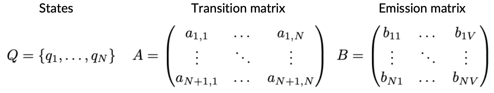
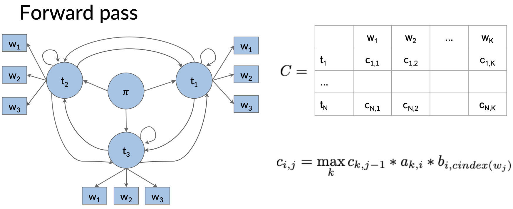
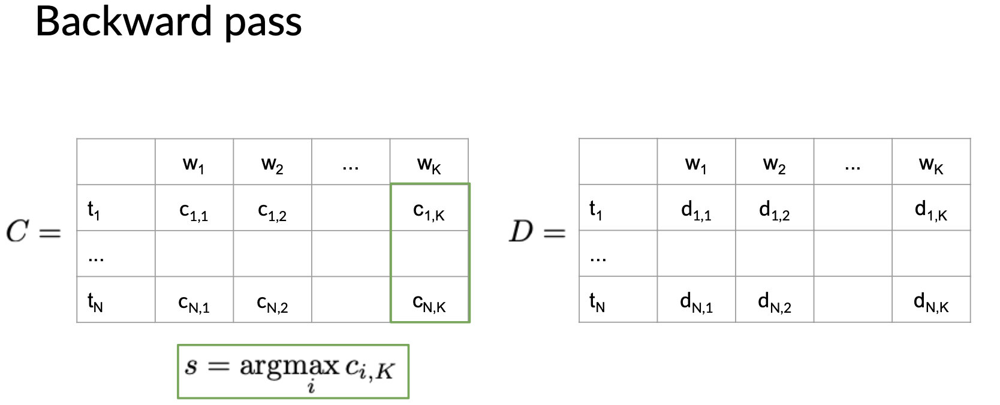
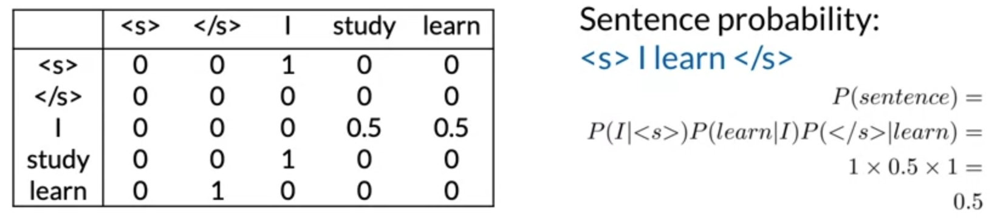
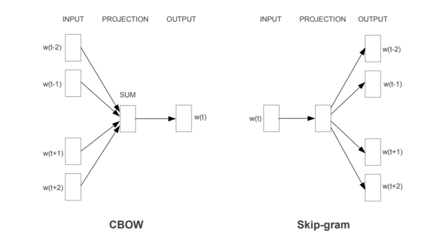
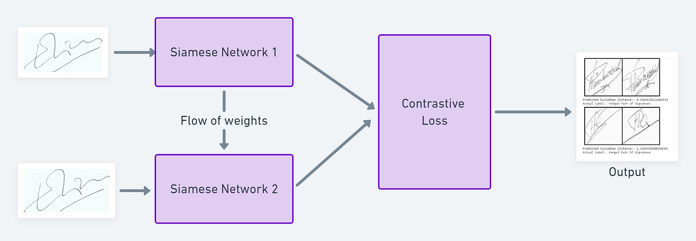
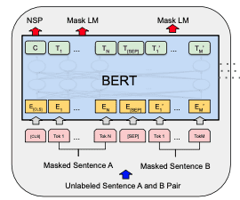

# 03 Natural Language Processing

## Table of Contents

- [Overview](#overview)
- [Foundational Principles](#foundational-principles)
- [Text Processing](#text-processing)
- [Core NLP Tasks](#core-nlp-tasks)
- [Statistical Models](#statistical-models)
- [Word Embeddings](#word-embeddings)
- [Architectures for Sequential Data](#architectures-for-sequential-data)
- [Sequence Models](#sequence-models)
- [Transformer Architecture and Modern LLMs](#transformer-architecture-and-modern-llms)
- [Prompt Engineering](#prompt-engineering)
- [Advanced Applications](#advanced-applications)
- [Responsible AI and Privacy](#responsible-ai-and-privacy)
- [References](#references)

## Overview

Natural Language Processing (NLP) is a field dedicated to making human language accessible to and processable by computers, encompassing the understanding, generation, and acquisition of language from data. Its foundations are deeply rooted in mathematical principles of probability and the function approximation capabilities of deep learning. Core algorithmic tools like Bayes' rule, neural networks, and gradient descent underpin the discipline's ability to model the complexities of language.

The field is structured around fundamental tasks such as classification, language modeling, and information extraction, which serve as building blocks for more sophisticated applications. Historically, progress was driven by statistical methods and architectures like Recurrent Neural Networks (RNNs) and Long Short-Term Memory (LSTM) networks. A paradigm shift occurred with the introduction of the Transformer architecture, whose self-attention mechanism enables parallel processing and capture of long-range dependencies. This has led to state-of-the-art Large Language Models (LLMs) like BERT and GPT.

These advanced models are now central to a wide range of applications including information retrieval, task-oriented dialogue systems, summarization, machine translation, and question answering. However, the increasing scale and power of these models introduce significant challenges in responsible AI, including data privacy, bias amplification, and factual accuracy.

## Foundational Principles

### Defining Natural Language

Natural Language Processing is the set of methods for making human language—a structured system of communication that evolved naturally through use—accessible to computers. This involves the analysis and understanding of text meaning, the generation of fluent and context-appropriate text, and the acquisition of these capabilities from data and knowledge.

**Syntax and Semantics:**

Language is governed by syntax (the rules for composition) and semantics (the meaning of the composition). While human languages have "rules," they are often not well-defined or strictly enforced.

**Characteristics:**

A key characteristic of natural language is that it is **lossy but efficient**, meaning information can be omitted or contain errors, yet the core message is still conveyed. An example is the six-word story: "For Sale: baby shoes, never worn."

**Contrast with Non-Natural Languages:**

In contrast, non-natural (or formal) languages like Python or C++ are deliberately planned with well-defined syntactical rules designed to eliminate ambiguity.

A central, unresolved challenge in NLP is defining what it means for a machine to "understand" or "know" a language. While powerful algorithms can imitate human language production and understanding, NLP remains an open research problem.

### Core Challenges in NLP

The inherent nature of human language makes it exceptionally difficult for computers to process accurately.

**Ambiguity:**

- **Lexical Ambiguity**: Words can have multiple meanings (e.g., "bank" as a financial institution or a river edge; "mean" as an average or an unkind disposition).
- **Domain-Specific Meanings**: The meaning of a word can change drastically with context (e.g., "Latex" can refer to a material or a document preparation system).
- **Syntactic Ambiguity**: The grammatical structure of a sentence can be interpreted in multiple ways. For instance, in "We saw the woman with the sandwich wrapped in paper," it is unclear whether the woman or the sandwich was wrapped in paper.

**Language Evolution and Composition:**

- **Assemblages and Portmanteaus**: Phrases like "take out" or blended words like "brunch" (breakfast + lunch) create new meanings.
- **Metaphorical and Non-Literal Language**: Expressions like "burn the midnight oil" or questions like "Can you pass the salt?" are not meant to be interpreted literally.
- **Neologisms**: Language constantly evolves with new words (e.g., "covid," "doomscrolling," "yeet").

### Mathematical and Algorithmic Tools

Modern NLP relies heavily on two algorithmic toolsets: probability and statistics, and deep learning.

**Probability and Statistics:**

NLP tasks are often recast as probability problems:

- **Sentiment Analysis**: What is the probability a review is positive given its sequence of words? $P(positive\_review|w_1,...,w_n)$.
- **Text Generation**: What is the most probable next word given the preceding words? $P(w_n|w_1,...,w_{n-1})$.
- **Bayes' Rule**: This is a particularly useful tool, especially in cause-and-effect scenarios, allowing inference of an unobservable cause from an observable effect, as in $P(CAUSE|EFFECT)$. The Naive Bayes assumption, which posits that effects are conditionally independent given the cause, is a common simplification.

**Deep Learning:**

A significant portion of state-of-the-art NLP is achieved using deep learning, a class of machine learning algorithms that use chains of differentiable modules to learn a function that maps inputs to outputs ($f(x) \rightarrow y$).

- **Function Approximation**: Neural networks act as powerful function approximators.
- **Supervised Learning**: Models are trained on labeled data pairs of inputs and expected outputs.
- **Training**: The process involves minimizing a **loss function** (e.g., Mean Squared Error, Cross-Entropy) via **gradient descent**, where model weights are adjusted to reduce error.

## Text Processing

### Preprocess

- Tokenization: Splitting text into individual words, phrases, symbols, or other meaningful elements called tokens.

- Lowercasing: Converting all characters in the text to lowercase.

- Removing Punctuation and Special Characters: Eliminating punctuation marks and non-alphabetic characters.

- Removing Stop Words: Filtering out common words (e.g., "and", "the", "a") that appear frequently but offer little value in understanding the essence of the text.

- Stemming: Trimming words down to their root form, often resulting in a form that is not a valid word.

- Lemmatization: Converting words into their base or dictionary form, ensuring that the reduced form is a valid word.

- Part-of-Speech Tagging: Identifying and tagging each word's part of speech (e.g., noun, verb, adjective) based on its definition and context.

### Feature Engineering

- Bag of Words (BoW): Represents text as fixed-length vectors by counting the frequency of each word appearing in the document.

- Term Frequency-Inverse Document Frequency (TF-IDF): Weighs the frequency of each word in a document against its rarity across all documents, helping to highlight words that are more interesting and distinguishing for a document.

- Word Embeddings: Maps words or phrases to vectors of real numbers in a high-dimensional space, capturing semantic relationships between words.

- N-grams: Combines adjacent words into phrases of n items (e.g., bigrams are 2-word combinations), helping to preserve some order of words.

## Core NLP Tasks

### Classification

Classification is a foundational NLP task that involves mapping an input text (word, sentence, document) to a label from a finite set. Many complex NLP problems can be framed as classification.

**Applications:**

Document topic identification, sentiment analysis, spam detection, language detection, and multiple-choice question answering.

**Feature Engineering:**

Supervised learning algorithms require structured inputs, known as features. A common technique is the **Bag-of-Words (BoW)** model, where a document is represented as a vector based on the presence or frequency of words (unigrams), pairs of words (bigrams), etc., disregarding order. Good feature sets are critical for algorithm performance.

**Classification Models:**

| Model | Description | Key Concepts |
|-------|-------------|--------------|
| **Bayesian Classification** | A probabilistic approach that views text as a latent phenomenon emitting observable features (words). It uses Bayes' rule to calculate the probability of a label given the features. | **Naive Bayes Assumption**: Assumes features are conditionally independent, simplifying the probability calculation. |
| **Logistic Regression** | Learns a set of weights (coefficients) for features to compute a score, which is then mapped to a probability. | **Binary**: Uses a sigmoid (logistic) function to map the score to a probability for a two-class problem. **Multinomial**: Uses the **softmax** function to convert scores for multiple classes into a probability distribution. |
| **Technical Considerations** | Handling numerical precision and zero probabilities is crucial. | **Log Probabilities**: Prevents underflow from multiplying many small probabilities by converting multiplication to addition. **Smoothing (Add-1)**: Avoids zero probabilities for unseen features by adding a small count to all feature frequencies. |

### Language Modeling

Language modeling is a simplified approximation of language production focused on modeling **fluency**. It assesses whether a sequence of words appears probable or can generate a sequence that looks like fluent language.

**Probabilistic Formulation:**

Fluency is approximated by the probability of a sequence of words, $P(w_1,...,w_n)$. Using the chain rule, this becomes $\prod_{t=1}^n P(W_t=w_t|W_1=w_1,...,W_{t-1}=w_{t-1})$.

**N-gram Models:**

The full history (context) is often intractable. N-gram models simplify this by limiting the context to a fixed window of $k$ previous words (e.g., a bigram model uses $k=1$).

**Neural Language Models:**

A neural network is trained to approximate the conditional probability $P(W_t=w_t|history;\theta)$. This involves several key components:

- **Tokenization**: Words are mapped to numerical IDs (tokens). Unknown words are handled with a special `UNK` token. Subword tokenization breaks complex words into common roots and affixes, reducing vocabulary size and eliminating the need for `UNK`.
- **Input Representation**: Tokens are represented as **one-hot vectors**.
- **Encoders/Embeddings**: An encoder layer (e.g., `nn.Embedding` in PyTorch) compresses the high-dimensional one-hot vector into a lower-dimensional, dense vector (an embedding). This forces the network to learn generalized representations where similar words have similar vectors.

**Evaluation with Perplexity:**

Perplexity is a measure of how "surprised" a model is by a test sequence. It is the exponentiated cross-entropy loss and can be interpreted as the effective number of choices (branching factor) the model has for the next word. A lower perplexity indicates a better model. State-of-the-art models achieve perplexity scores around 20 on internet corpora.

## Statistical Models

### Hidden Markov Model

Hidden Markov Models (HMMs) are statistical models used for sequence labeling tasks such as part-of-speech tagging, where the goal is to assign a tag (hidden state) to each word (observation) in a sequence.

**Components:**
- **States**: Hidden states (e.g., POS tags: noun, verb, adjective)
- **Observations**: Visible elements (e.g., words in a sentence)
- **Transition probability**: Probability of moving from one state to another
- **Emission probability**: Probability of observing a word given a state

**Probability Formulas:**

Transition probability with smoothing:
$$
P(t_i|t_{i-1})=\frac{C(t_{i-1},t_i)+\epsilon}{\sum_{j=1}^N C(t_{i-1},t_j)+N \cdot \epsilon}
$$

Emission probability with smoothing:
$$
P(w_i|t_i)=\frac{C(t_i,w_i)+\epsilon}{\sum_{j=1}^V C(t_i,w_j)+V \cdot \epsilon}
$$

where:
- $C(t_{i-1},t_i)$: count of transition from tag $t_{i-1}$ to $t_i$
- $C(t_i,w_i)$: count of word $w_i$ with tag $t_i$
- $\epsilon$: smoothing parameter
- $N$: number of tags, $V$: vocabulary size

Viterbi Algorithm:

### N-Gram Language Model

N-gram models predict the probability of a word based on the previous N-1 words, using the Markov assumption that only recent context matters.

**N-Gram Probability:**
$$
P(w_N|w_1^{N-1})=\frac{C(w_1^{N-1}w_N)}{C(w_1^{N-1})}
$$

where $C(\cdot)$ denotes the count of the sequence in the corpus.

**Sequence Probability (Chain Rule):**
$$
P(A,B,C,D)=P(A)P(B|A)P(C|A,B)P(D|A,B,C)
$$

**Markov Assumption:**

- Markov assumption: only last N words matter $P(w_N|w_1^{N-1})=P(w_N|w_{N-1})$ (Bigram)
- Start and end of sentence: start token \<s>, end token\</s>, add N-1 start tokens for N-Gram $model$

$$
p(A,B,C,D)=P(s)P(A|s)P(B|A)P(C|B)P(D|C)P(/s|D)
$$

Model Evaluation: 

- Perplexity: The smaller the perplexity, the better the model

$$
PP(W)=P(s_1,s_2,...,s_m)^{-1/m}
$$

$$
PP(W)=m\sqrt{\prod_{i=1}^m\prod_{j=1}^{|s_i|}\frac{1}{P(w_j^{(i)}|w_{j-1}^{(i)})}},for\ bigram\ model
$$

$$
PP(W)=m\sqrt{\prod_{i=1}^m\frac{1}{P(w_i|w_{i-1})}},concatenate\ all\ sentences
$$

Out of Vocabulary Words:

- Unknown words can be represented by UNK

Smoothing:

- Laplacian smoothing: $P(w_n|w_{n-1})=\frac{C(w_{n-1},w_n)+1}{C(w_{n-1})+V}$
- Add-k smoothing: $P(w_n|w_{n-1})=\frac{C(w_{n-1},w_n)+k}{C(w_{n-1})+k*V}$

- Backoff: if the higher n-gram probability is missing, then use the lower-order probability

- Interpolation: $\hat P(w_n|w_{n-2},w_{n-1})=\lambda_1P(w_n|w_{n-2},w_{n-1})+\lambda_2P(w_n|w_{n-1})+\lambda_3P(w_n)$

## Word Embeddings

Word embeddings are dense vector representations of words that capture semantic relationships. Words with similar meanings have similar vector representations.

### CBOW (Continuous Bag of Words)

CBOW predicts a target word from its surrounding context words.

**Architecture:**
- **Input Layer**: Context words represented as one-hot vectors. For context size $C$ (words before and after target) and vocabulary size $V$, input has $2C$ one-hot vectors of size $V$.
- **Projection Layer**: One-hot vectors projected onto shared dense embedding layer, then averaged to create context representation.
- **Output Layer**: Softmax layer predicts target word from context representation.

**Objective:**

Maximize probability of target word given context:
$$
P(w_t|w_{t-C},...,w_{t-1},w_{t+1},...,w_{t+C})
$$

### Skip-Gram

Skip-Gram predicts surrounding context words from a target word (inverse of CBOW).

**Architecture:**
- **Input Layer**: Single target word as one-hot vector
- **Projection Layer**: One-hot vector projected onto dense embedding layer
- **Output Layer**: Softmax layers predict context words

**Objective:**

Maximize probability of context words given target:
$$
P(w_{t-C},...,w_{t-1},w_{t+1},...,w_{t+C}|w_t)
$$

**Comparison with CBOW:**
- Skip-Gram: Better for rare words, more training time
- CBOW: Faster training, better for frequent words

### GloVe (Global Vectors)

GloVe combines global matrix factorization and local context window methods.

**Co-occurrence Matrix Construction:**

Construct matrix $X$ where $X_{ij}$ represents how often word $i$ occurs in context of word $j$ within a fixed window size.

**Objective Function:**
$$
J = \sum_{i,j=1}^{V} f(X_{ij})(\mathbf{w}_i^T \tilde{\mathbf{w}}_j + b_i + \tilde{b}_j - \log X_{ij})^2
$$

where:
- $\mathbf{w}_i$, $\tilde{\mathbf{w}}_j$: word vectors
- $b_i$, $\tilde{b}_j$: bias terms
- $f(X_{ij})$: weighting function that reduces impact of very frequent co-occurrences

**Key Insight:**

The ratio of co-occurrence probabilities captures meaning:
$$
\frac{P(k|i)}{P(k|j)}
$$

reveals relationships between words $i$, $j$, and $k$.

## Architectures for Sequential Data

### Recurrent Neural Networks (RNNs)

RNNs are designed to process sequential data. At each time-step, an RNN takes an input (e.g., a word embedding) and its own hidden state from the previous time-step to produce an output and a new hidden state. This recurrence allows the hidden state to act as a memory, encoding information about everything that has come before. However, standard RNNs struggle to retain information over long sequences due to issues like vanishing gradients.

### Long Short-Term Memory (LSTM) Networks

LSTMs are an advanced type of RNN cell designed to overcome the long-term dependency problem. They introduce a **memory cell** state ($c_t$) alongside the hidden state ($h_t$). The flow of information is controlled by a series of "gates"—neural networks with sigmoid activations—that learn what information to add, keep, or remove.

**Gates:**

- **Forget Gate**: Decides what information to discard from the previous cell state.
- **Input Gate**: Decides what new information from the current input and hidden state to store in the cell state.
- **Output Gate**: Determines what part of the cell state should be output as the new hidden state.

By managing information this way, LSTMs can maintain a "short-term" memory for a longer duration than standard RNNs.

### Sequence-to-Sequence (Seq2Seq) Models

Seq2Seq models are built for tasks where the input and output are both sequences of arbitrary length, such as machine translation. The architecture consists of two main components:

1. **Encoder**: An RNN or LSTM that processes the entire input sequence and compresses its information into a final hidden state, often called the **context vector**.
2. **Decoder**: Another RNN or LSTM that is initialized with the context vector and generates the output sequence one token at a time.

A common training technique is **Teacher Forcing**, where instead of feeding the decoder's own (potentially incorrect) prediction as input for the next time-step, the true ground-truth token from the training data is used. This stabilizes and accelerates training.

### The Attention Mechanism

A key limitation of the basic Seq2Seq model is the bottleneck of the fixed-length context vector, which must encode the entire input sequence. The **attention mechanism** resolves this by allowing the decoder to look back at *all* of the encoder's hidden states at each step of generation.

It computes a set of attention scores (often via a dot product between the decoder's current hidden state and each encoder hidden state), which are passed through a softmax function to create a probability distribution. This distribution is used to create a weighted average of the encoder hidden states, producing a dynamic context vector that focuses on the most relevant parts of the input for generating the current output token.

## Sequence Models

### Siamese Network

- **Architecture**: The core architecture of a Siamese network consists of two identical neural networks, each taking one of the two input vectors. The outputs of these networks are then fed into a metric function that computes a distance or similarity score between the inputs.
- **Weight Sharing**: The two subnetworks share the same weights and architecture, ensuring that they process their respective inputs in the same way. This shared learning helps the network learn more efficiently and reduces the number of parameters needed, which can mitigate overfitting.
- **Contrastive Loss**: Siamese networks often use a contrastive loss function during training. This type of loss function is designed to ensure that similar input pairs are brought closer together in the embedding space, while dissimilar pairs are pushed apart. This training approach enables the network to learn discriminative features that are effective at differentiating between inputs.

## Transformer Architecture and Modern LLMs

The Transformer, introduced in 2017, is an architecture that dispenses with recurrence and relies entirely on attention mechanisms to process sequences. It has become the dominant architecture for large-scale NLP models.

### Core Concepts

The Transformer combines three key insights:

1. **Encoder-Decoder Structure**: It operates on a large, fixed-size window of tokens, processing the entire input and output sequences at once in parallel.
2. **Self-Attention**: Instead of recurrence, it uses a mechanism where each token can attend to every other token within the same sequence (input or output). This allows the model to capture complex, long-range dependencies directly. To handle multiple types of relationships, **multi-headed self-attention** applies this process multiple times in parallel with different learned transformations.
3. **Positional Embeddings**: Since the model has no inherent sense of sequence order, positional information (often using sine and cosine functions) is added to the token embeddings.

### Attention

The attention mechanism, at its core, involves computing a set of attention weights and using them to produce a weighted sum of some values. These weights determine the amount of "attention" or importance given to each part of the input data. Below are the formulas for different types of attention mechanisms, which highlight their distinct approaches to calculating these attention weights and the resulting context or output vectors.

**Soft Attention**:
$$
F(Q,K,V)=softmax(\frac{QK^T}{\sqrt{d_k}})V
$$
In this formula, $Q$, $K$, and $V$ stand for Query, Key, and Value matrices, respectively, and $d_k$ is the dimensionality of the keys. This type of attention allows for a distribution of focus across all positions with a gradient that is easily computable.

**Self-Attention (Intra-Attention)**:

Self-attention allows the model to attend to different positions of the same input sequence. The formula is similar to the soft attention mechanism but applied within a single sequence.
$$
F(Q,K,V)=softmax(\frac{QK^T}{\sqrt{d_k}})V
$$
Here, $Q$, $K$, and $V$ are derived from the same input sequence but transformed through different weight matrices.

**Multi-Head Attention**:

Multi-head attention runs the attention mechanism multiple times in parallel. The outputs are then concatenated and linearly transformed into the expected dimension. The formula for Multi-Head Attention is:
$$
F(Q,K,V)=Concat(head_1,...,head_h)W^O
$$

$$
head_i=A(QW_i^Q,KW_i^K,VW_i^V)
$$

In this setup, $W_i^Q$, $W_i^K$, $W_i^V$, and $W^O$ are parameter matrices, and $h$ is the number of heads.

### Transformer

- **Encoder**: The encoder maps an input sequence of symbol representations (words, for instance) to a sequence of continuous representations. The Transformer encoder consists of a stack of identical layers, each with two main sub-layers: a multi-head self-attention mechanism and a position-wise fully connected feed-forward network.
- **Decoder**: The decoder is responsible for transforming the encoder's output into the final output sequence. Like the encoder, the decoder is composed of a stack of identical layers. However, in addition to the two sub-layers found in the encoder layers, each decoder layer has a third sub-layer that performs multi-head attention over the encoder's output. This setup enables the decoder to focus on appropriate parts of the input sequence when producing the output.

- **Self-Attention**: This mechanism allows the model to weigh the importance of different words in the input sequence relative to each other. It's a crucial component for understanding the context and relationships between words in a sentence.
- **Multi-Head Attention**: By splitting the attention mechanism into multiple "heads," the model can simultaneously attend to information from different representation subspaces at different positions. This approach increases the model's ability to focus on various aspects of the context.
- **Positional Encoding**: Since the Transformer does not inherently process sequences in order (like RNNs or LSTMs), it uses positional encodings to give the model information about the position of each word in the sequence.

### Key Models

**BERT (Bidirectional Encoder Representations from Transformers):**

BERT is an encoder-only model pre-trained to predict randomly masked words in a sentence. This bidirectional training allows it to learn deep contextual relationships between words. The resulting **contextual embeddings** are highly effective for a wide range of language understanding tasks like classification and question answering. However, its bidirectional nature makes it unsuitable for text generation.

**Key Characteristics:**

- **Bidirectional Training**: Unlike previous models that processed text either from left to right or combined both directions, BERT reads text in both directions simultaneously, understanding context from both left and right of each word.
- **Transformer Architecture**: Based on the Transformer's encoder mechanism, allowing words to be processed in relation to all other words simultaneously.
- **Pre-training Tasks**: Masked language modeling (MLM) where random tokens are masked and predicted, and next sentence prediction (NSP) to learn relationships between sentences.

**GPT (Generative Pre-trained Transformer):**

GPT is a decoder-only model trained to predict the next token in a sequence. Its architecture is auto-regressive, making it inherently suited for text generation. Large GPT models can perform a variety of tasks in a **zero-shot** or **few-shot** manner through **prompting**, where examples of the task are provided in the input context.

**Key Characteristics:**

- **Transformer Architecture**: Utilizes the Transformer's decoder mechanism for generating text, predicting the next word given all previous words.
- **Autoregressive Model**: Predicts the next token based on preceding tokens, making it well-suited for text generation tasks.
- **Prompting Capability**: Can perform various tasks through prompting without task-specific training.

### Fine-Tuning and Instruction Tuning

While large pre-trained models (often called **Foundation Models**) are highly capable, their performance can be improved for specific tasks through **fine-tuning**. This involves continuing the training process on a smaller, specialized dataset.

**Instruction Tuning:**

A special case where the model is fine-tuned on a dataset of prompts and human-corrected responses. This teaches the model to treat prompts as instructions to be followed rather than simply as text to be continued, making it more helpful and aligned with user intent.

**Reinforcement Learning from Human Feedback (RLHF):**

A related technique that uses human preferences (e.g., thumbs up/down) as a reward signal to further align model behavior with desired outcomes.

## Prompt Engineering

Prompt engineering is the practice of designing inputs to large language models to elicit desired outputs. This has become crucial for effectively using modern LLMs like GPT, Claude, and others.

### Best Practices

**Write Clear Instructions:**

  - Include details in your query to get more relevant answers

  - Ask the model to adopt a persona

  - Use delimiters to clearly indicate distinct parts of the input

  - Specify the steps required to complete a task

  - Provide examples

  - Specify the desired length of the output

**Provide Reference Text:**

  - Instruct the model to answer using a reference text
  - Instruct the model to answer with citations from a reference text

**Split Complex Tasks into Simpler Subtasks:**

  - Use intent classification to identify the most relevant instructions for a user query
  - For dialogue applications that require very long conversations, summarize or filter previous dialogue
  - Summarize long documents piecewise and construct a full summary recursively

**Give the Model Time to "Think":**

  - Instruct the model to work out its own solution before rushing to a conclusion
  - Use inner monologue or a sequence of queries to hide the model's reasoning process
  - Ask the model if it missed anything on previous passes

**Use External Tools:**

  - Use embeddings-based search to implement efficient knowledge retrieval
  - Use code execution to perform more accurate calculations or call external APIs
  - Give the model access to specific functions

**Test Changes Systematically:**

  - Evaluate model outputs with reference to gold-standard answers

## Advanced Applications

### Information Retrieval

Information Retrieval (IR) is the task of searching for relevant information within a large collection of documents.

**Classical Methods:**

Early systems relied on term-matching:

- **Boolean retrieval**: Used operators like AND/OR/NOT.
- **Ranked retrieval**: Scores documents based on relevance. **TF-IDF (Term Frequency-Inverse Document Frequency)** is a cornerstone heuristic that weights terms by their importance within a document and rarity across the collection.
- **Inverted index**: A critical data structure for efficient implementation.
- **BM25**: A probabilistic model that extends these ideas with more formal statistical grounding.

**Neural IR:**

Modern approaches cast IR as a machine learning problem:

- **Learning to Rank**: Models are trained on features to predict relevance, often in a **reranking pipeline** where a fast initial retriever (like BM25) creates a candidate list that is then re-ranked by a more complex model.
- **Embedding-based Retrieval**: Encodes both queries and documents into dense vectors (embeddings). Retrieval becomes a nearest-neighbor search problem in the embedding space. **Dense Passage Retrieval (DPR)** uses a bi-encoder BERT model to create powerful embeddings for first-stage retrieval.

### Machine Reading and Question Answering

This domain focuses on extracting structured knowledge and answering questions from unstructured text.

**Open Information Extraction (Open IE):**

Aims to extract structured `(subject, relation, object)` triples from text without pre-defining the relations. A common unsupervised approach relies on **Dependency Parsing**, which analyzes the grammatical relationships between words. The path between two entities in a dependency parse reveals their relationship.

**Frames and Events:**

To capture deeper semantics, especially for events and "why" questions, systems can use linguistic resources like **FrameNet** and **VerbNet**. These resources define "frames" (e.g., a REVENGE frame involves an avenger, offender, injury, etc.) that provide rich, structured knowledge about events.

**Open-Domain Question Answering:**

Modern QA systems typically use a **Retriever-Reader framework**. The **Retriever** finds relevant passages from a large corpus (e.g., Wikipedia), and the **Reader** (often a BERT-based model) carefully reads these passages to extract a specific answer span. For complex questions requiring information from multiple sources, **multi-hop reasoning** is necessary, where the system performs sequential retrieval steps.

### Summarization

Summarization is the task of creating a concise and faithful representation of a longer text.

| Type | Description | Pros & Cons | Models |
|------|-------------|-------------|--------|
| **Extractive** | Selects key sentences or phrases directly from the source text to form the summary. | **Pros**: Guaranteed to be faithful. **Cons**: Can be redundant and lack coherence. | **BertSum**: Treats summarization as a sentence classification task, using BERT to score and select sentences. |
| **Abstractive** | Generates new sentences from scratch to capture the core meaning of the source text. | **Pros**: Generally coherent and non-redundant. **Cons**: Prone to **hallucination** (generating factually incorrect information). | **Pointer-Generator Networks**: A hybrid model that can either generate new words or copy words directly from the source. **BART/T5**: Pre-trained seq2seq models that achieve state-of-the-art results when fine-tuned. |
| **Evaluation** | Metrics are used to assess summary quality. | **ROUGE (Recall-Oriented Understudy for Gisting Evaluation)**: Measures n-gram overlap with a reference summary. **BERT-score/BART-score**: Use pre-trained models to measure semantic similarity and faithfulness. | |

### Machine Translation

Machine Translation (MT) focuses on automatically translating text from a source language to a target language.

**Statistical MT (SMT):**

Dominated the field for decades. **Phrase-based SMT** was a key approach, learning phrase-to-phrase translation probabilities from large **parallel corpora**. It used word alignment to identify corresponding phrases and **beam search** to efficiently find the most probable translation by stitching these phrases together. Quality was evaluated using the **BLEU** score.

**Neural MT (NMT):**

Revolutionized the field. Early NMT models used Seq2Seq architectures with LSTMs and attention. **Bidirectional LSTMs** were important for capturing context from both left and right in the source sentence. Today, **Transformers** are the state-of-the-art, enabling powerful **multilingual models** that can translate between many language pairs with a single architecture.

### Task-Oriented Dialogue Systems

These systems are designed to help users accomplish a specific goal (e.g., booking a flight, finding a restaurant) through conversation.

**Classic Pipeline:**

1. **Automatic Speech Recognition (ASR)**: Converts user speech to text.
2. **Natural Language Understanding (NLU)**: Extracts the user's goal (**intent prediction**) and key information (**slot filling**).
3. **Dialogue Manager**: Tracks the conversational state (**dialogue state tracking**), interacts with backend knowledge bases, and decides the system's next action (**dialogue policy**).
4. **Natural Language Generation (NLG)**: Converts the system's action into a natural language response.

**End-to-End Systems:**

Modern approaches often use deep learning to train the entire pipeline jointly, sometimes with complex multi-network architectures for intent prediction, belief tracking, and response generation. Error recovery strategies are crucial for handling misunderstandings and maintaining a successful dialogue.

## Responsible AI and Privacy

### Societal Harms and Risks

The widespread deployment of powerful NLP models carries significant societal risks that must be addressed responsibly.

**Factual Errors and Misinformation:**

LLMs can **hallucinate**, generating text that is fluent and plausible but factually incorrect. This can be used to create and spread misinformation, conspiracy theories, and defamatory content at an unprecedented scale.

**Prejudicial Bias:**

Models trained on large internet corpora inevitably learn and can amplify the societal biases (related to gender, race, nationality, etc.) present in that data. This can perpetuate harmful stereotypes and lead to unfair or demeaning outputs.

**Cognitive Harms:**

As chatbots become more human-like, they can cause psychological harm. An agreeable chatbot might reinforce negative thought patterns like suicidal ideation.

**Worker Displacement:**

NLP systems that automate knowledge work, such as coding or writing assistance, can increase worker productivity to the point where fewer people are needed for the same amount of work, leading to job displacement.

### Privacy Preservation

A critical technical challenge is that large models can memorize and leak sensitive, private information from their training data. Simply ensuring a model generalizes well does not guarantee privacy, as memorization of specific data points is a worst-case risk.

**K-Anonymity:**

An early approach that involves anonymizing data by bucketing or removing features to ensure any individual record is indistinguishable from at least k-1 other records. It is intuitive but subjective and provides no formal guarantee.

**Differential Privacy (DP):**

A formal, mathematical definition of privacy. It guarantees that the output of an algorithm does not change significantly whether any single individual's data is included in the dataset or not.

**DP-SGD (Differentially Private Stochastic Gradient Descent):**

This is the primary method for training machine learning models with DP. It involves two key steps during backpropagation:

1. **Gradient Clipping**: The norm of each individual per-sample gradient is clipped to a maximum threshold. This limits the influence of any single data point.
2. **Noise Addition**: Calibrated noise (e.g., from a Gaussian distribution) is added to the aggregated batch of clipped gradients before the model weights are updated.

DP introduces a direct trade-off between privacy and model accuracy and has practical implications for training, including increased memory usage and potential convergence issues.

## References

**Course Materials:**
- CS 7650: Natural Language Processing - Georgia Tech OMSCS

**Foundational Papers:**
- Ashish Vaswani et al., "Attention Is All You Need," *NIPS* 2017
- Jacob Devlin et al., "BERT: Pre-training of Deep Bidirectional Transformers for Language Understanding," *NAACL* 2019
- Alec Radford et al., "Language Models are Unsupervised Multitask Learners," *OpenAI* 2019
- Tomas Mikolov et al., "Efficient Estimation of Word Representations in Vector Space," *arXiv* 2013
- Jeffrey Pennington et al., "GloVe: Global Vectors for Word Representation," *EMNLP* 2014
- Sepp Hochreiter, Jürgen Schmidhuber, "Long Short-Term Memory," *Neural Computation* 1997
- Ilya Sutskever et al., "Sequence to Sequence Learning with Neural Networks," *NIPS* 2014
- Dzmitry Bahdanau et al., "Neural Machine Translation by Jointly Learning to Align and Translate," *ICLR* 2015
- Vladimir Karpukhin et al., "Dense Passage Retrieval for Open-Domain Question Answering," *EMNLP* 2020
