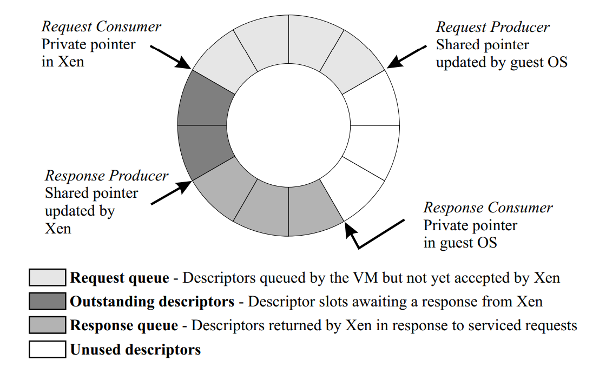

# 07 Virtualization

## Table of Contents

1. [Overview](#overview)
2. [Motivation and Utility Computing](#motivation-and-utility-computing)
3. [Historical Context](#historical-context)
4. [Hypervisors](#hypervisors)
5. [Virtualization Approaches](#virtualization-approaches)
6. [CPU Virtualization](#cpu-virtualization)
7. [Memory Virtualization](#memory-virtualization)
8. [Device Virtualization](#device-virtualization)
9. [Measuring Time and Resource Usage](#measuring-time-and-resource-usage)
10. [Modern Hardware Support](#modern-hardware-support)
11. [Related Topics](#related-topics)
12. [References](#references)

## Overview

Virtualization extends the concept of operating system extensibility by enabling the simultaneous co-existence of multiple complete operating systems on top of the same hardware platform. This technology allows multiple guest operating systems to run independently on shared hardware resources, managed by a specialized layer called a hypervisor or Virtual Machine Monitor (VMM). The concept, pioneered by IBM VM/370 in the 1960s and 70s, has become fundamental to modern cloud computing and data center operations.

## Motivation and Utility Computing

### Cost Reduction Through Resource Sharing

The primary motivation for virtualization is cost reduction through efficient resource sharing. Virtualization enables companies to provide users with an experience equivalent to owning dedicated hardware platforms at a fraction of the cost by providing virtual platforms instead. From the user's perspective, a virtual platform functions identically to a real one, running applications without concern for the underlying implementation.

### Resource Aggregation

Virtualization facilitates utility computing by sharing hardware resources across multiple user communities, significantly reducing the cost of ownership and maintenance. The underlying principle leverages the fact that resource usage is typically bursty. By aggregating bursty demands from multiple users, a cumulative usage pattern emerges that can be serviced by a shared pool of resources. This allows individual users to potentially access more resources than they could individually afford at a fraction of the cost.

### Modern Cloud Computing

Major cloud providers like Amazon Web Services and Microsoft employ this model, providing resources on a shared, rental, or utility basis. Virtualization represents the logical extension of the idea of extensibility or specialization of services, applied at a much larger granularity—namely an entire operating system.

## Historical Context

The concept of virtualization dates back to the IBM VM/370 in the 1960s and 70s, which aimed to give every user the illusion that the computer was theirs exclusively. Modern virtualization gained resurgence in the early 2000s with projects like Stanford's SimOS (which formed the basis for VMware) and technologies like Xen. Initial applications included application mobility, server consolidation, collocating hosting facilities, and distributed web services.

Today, virtualization has become mainstream because companies can now provide resources with complete performance isolation and bill each individual user separately. It has transformed computing into a utility, much like electricity and water services.

## Hypervisors

To manage multiple operating systems on shared hardware, a specialized Virtual Machine Monitor (VMM) or hypervisor is needed—essentially an "operating system of operating systems." The operating systems running on top of the shared hardware are called virtual machines (VMs) or guest operating systems.

### Types of Hypervisors

**Native Hypervisor (Bare Metal):**
- Runs directly on top of bare hardware
- Guest operating systems run on top of this hypervisor
- Offers the best performance for guest operating systems due to minimal interference
- Examples: VMware ESXi, Xen

**Hosted Hypervisor:**
- Runs as an application process on top of a host operating system
- Guest operating systems are clients of this hosted hypervisor
- Examples: VMware Workstation, VirtualBox

```
Native (Bare Metal) Hypervisor        Hosted Hypervisor
==================================    =================================

┌──────────┬──────────┬───────────┐   ┌──────────┬──────────┬──────────┐
│  Guest   │  Guest   │  Guest    │   │  Guest   │  Guest   │  Guest   │
│   OS 1   │   OS 2   │   OS 3    │   │   OS 1   │   OS 2   │   OS 3   │
├──────────┴──────────┴───────────┤   ├──────────┴──────────┴──────────┤
│                                 │   │   Hypervisor (Application)     │
│         Hypervisor (VMM)        │   ├────────────────────────────────┤
│                                 │   │      Host Operating System     │
├─────────────────────────────────┤   ├────────────────────────────────┤
│         Hardware Platform       │   │      Hardware Platform         │
└─────────────────────────────────┘   └────────────────────────────────┘
```

## Virtualization Approaches

### Full Virtualization

In full virtualization, the operating system remains completely untouched—not even a single line of code is modified. The guest operating system believes it is running on bare metal.

**Trap and Emulate Strategy:**
1. Guest operating systems run as user-level processes
2. When a guest OS attempts to execute a privileged instruction, it triggers a trap into the hypervisor
3. The hypervisor emulates the intended functionality of the operating system

```
Full Virtualization: Trap and Emulate
======================================

┌──────────────────────────────────────────────────────┐
│              Guest Operating System                  │
│         (Unmodified - runs at user level)            │
│                                                      │
│  Application ──► System Call ──► Privileged Instr.   │
└───────────────────────────┬──────────────────────────┘
                            │
                            │ Trap (implicit)
                            ▼
┌──────────────────────────────────────────────────────┐
│                    Hypervisor                        │
│                                                      │
│  1. Catch trap from privileged instruction           │
│  2. Validate operation                               │
│  3. Emulate the intended functionality               │
│  4. Return control to Guest OS                       │
└───────────────────────────┬──────────────────────────┘
                            │
                            ▼
                     Hardware Access
```

**Architectural Challenges:**

A significant issue with full virtualization, particularly in older Intel architectures, is that some privileged instructions may fail silently rather than trapping to the hypervisor. To counter this, hypervisors employ a binary translation strategy, identifying and modifying problematic instructions in the guest operating system binaries. Newer hardware from Intel and AMD includes virtualization support to mitigate these issues.

**Example:** VMware ESX Server

### Para-virtualization

Para-virtualization involves modifying the source code of the guest operating system. This allows for avoiding problematic instructions and including optimizations, such as letting the guest operating system see real hardware resources underneath the hypervisor.

**Key Characteristics:**
- Guest OS source code is modified to be aware of the hypervisor
- Applications remain unchanged—the interfaces that applications see are exactly the interfaces provided by the operating system
- Modifications are typically small (approximately 1-1.36% of the codebase for Linux and Windows XP)
- Uses explicit hypercalls instead of implicit traps

```
Para-virtualization: Explicit Hypercalls
=========================================

┌──────────────────────────────────────────────────────┐
│              Guest Operating System                  │
│         (Modified - aware of hypervisor)             │
│                                                      │
│  Application ──► System Call ──► Hypercall API       │
└───────────────────────────┬──────────────────────────┘
                            │
                            │ Hypercall (explicit)
                            ▼
┌──────────────────────────────────────────────────────┐
│                    Hypervisor                        │
│                                                      │
│  Hypercall Interface:                                │
│  • create_page_table()                               │
│  • switch_to_page_table()                            │
│  • update_page_table()                               │
│  • device_operation()                                │
│                                                      │
│  Direct execution of privileged operations           │
└───────────────────────────┬──────────────────────────┘
                            │
                            ▼
                     Hardware Access
```

**Example:** Xen

### Comparison of Virtualization Approaches

| Feature | Full Virtualization | Para-virtualization |
|---------|---------------------|---------------------|
| **GOS Code Modification** | No modification—binary remains unchanged | Source code modified (typically 1-2% of codebase) |
| **GOS Awareness** | Unaware of hypervisor—believes it runs on bare metal | Aware of hypervisor presence |
| **Privileged Operations** | Trap and emulate—traps on privileged instructions | Explicit hypercalls to hypervisor |
| **Handling Quirk Architectures** | Binary translation/rewriting for silently failing instructions | Modified source code avoids problematic instructions |
| **GOS → Hypervisor Control Transfer** | Implicit via traps | Explicit via hypercalls |
| **Memory Management** | Hypervisor maintains PPN to MPN mapping in Shadow Page Table | GOS manages PPN to MPN mapping using hypercalls |
| **I/O Virtualization** | Trap and emulate—little innovation | Clean device abstractions, shared buffers, zero-copy |
| **Interrupt Control** | Events delivered as they occur | GOS has explicit control over event delivery |
| **Examples** | VMware ESX Server | Xen |

## CPU Virtualization

CPU virtualization aims to give each guest operating system the illusion that it owns the CPU and is unaware of other guests on the same CPU.

### Scheduling and Accountability

The hypervisor acts as a scheduler, allocating CPU time to different VMs:

**Scheduling Policies:**
- **Proportional Share Scheduler (VMware ESX Server):** Allocates CPU shares based on service agreements
- **Fair Share Scheduler:** Gives an equal share of the CPU to each guest operating system

The hypervisor accounts for the time used on the CPU by each guest for billing purposes, including time stolen from a particular VM to service external interrupts that did not belong to it.

### Handling Program Discontinuities

When a process executes on the CPU within a VM, various program discontinuities can occur, which the hypervisor must field and pass to the appropriate guest operating system:

- **System calls:** Calls into the guest OS
- **Page faults:** Occur when a virtual page is not in machine memory
- **Exceptions:** Such as divide by zero
- **External interrupts:** Asynchronous events not initiated by the process

All these events are packaged as software interrupts by the hypervisor and delivered to the guest operating system, which then handles them as it would on bare metal.

### Challenges with Privileged Instructions

**Full Virtualization Challenges:**
1. Guest OSes run at user-level privilege
2. When a guest OS tries to execute a privileged instruction, it should trap into the hypervisor
3. In older x86 architectures, some privileged instructions fail silently when executed at user level
4. Hypervisors must be aware of hardware quirks and employ binary rewriting to detect and handle silently failing instructions
5. Newer versions of Intel and AMD architectures include virtualization support to address these issues

**Communication Mechanisms:**
- **Full Virtualization:** Communication is always implicit via traps
- **Para-virtualization:** Communication is explicit via hypercalls

## Memory Virtualization

Memory virtualization is crucial to performance in virtualized environments due to its impact on the entire memory hierarchy.

### Memory Address Translation

In a virtualized setup, the hypervisor controls the machine memory (real physical memory), while each guest operating system's physical memory is itself an illusion. This guest-perceived physical memory is often non-contiguous in real machine memory due to dynamic allocation and sharing.

**Two-Step Translation Process:**

1. **Virtual Page Number (VPN) to Physical Page Number (PPN):** Handled by the guest OS's page table
2. **Physical Page Number (PPN) to Machine Page Number (MPN):** Handled by the hypervisor, typically using a shadow page table

The shadow page table acts as the hardware page table in architectures where the CPU uses the page table for address translation.

### Efficient Mapping in Full Virtualization

Since a fully virtualized guest OS is unaware of machine pages, the hypervisor maintains the PPN to MPN mapping. To ensure efficiency on every memory access:

1. The hypervisor intercepts guest OS attempts to update its page tables (privileged instructions that cause traps)
2. The hypervisor directly updates the shadow page table (or hardware page table/TLB) with the VPN to MPN mapping
3. This bypasses the guest OS's page table for future translations, allowing direct VPN to MPN translation at hardware speeds

This technique is used in VMware ESX Server.

### Efficient Mapping in Para-virtualization

In para-virtualization, the guest OS knows that its physical memory is not contiguous and can be made aware of machine memory. Therefore, the burden of PPN to MPN mapping can be shifted to the guest OS.

**Hypercalls for Memory Management:**

- `create_page_table`: Allocate and initialize a page frame as a page table
- `switch_to_page_table`: Change the active hardware page table during a context switch
- `update_page_table`: Update specific entries in the page table after events like page faults

This cooperative approach allows the guest OS to manage its page tables, leading to efficient address translation at hardware speeds.

### Dynamic Memory Management: Ballooning

To handle bursty memory requirements and over-commitment of memory, a technique called ballooning is used:

**Inflation Process:**
1. A special balloon device driver is installed in each guest OS
2. If the hypervisor needs more memory, it contacts a guest OS that is not actively using all of its memory via a private channel
3. It instructs the balloon driver to inflate, causing it to request memory from the guest OS
4. The guest OS pages out data to disk to satisfy the balloon's requests
5. The memory acquired by the balloon driver is returned to the hypervisor, freeing up machine memory

**Deflation Process:**

When a guest needs more memory, the hypervisor tells the balloon to deflate, releasing memory back to the guest OS, which can then page in data from disk.

Ballooning assumes cooperation with the guest operating system and is applicable to both full and para-virtualized environments.

```
Memory Ballooning Mechanism
============================

Inflation (Reclaim Memory):                Deflation (Return Memory):

┌──────────────────┐                       ┌──────────────────┐
│    Guest OS 1    │                       │    Guest OS 1    │
│  ┌────────────┐  │                       │  ┌────────────┐  │
│  │   Balloon  │  │  ◄── Inflate          │  │   Balloon  │  │  ◄── Deflate
│  │   Driver   │  │                       │  │   Driver   │  │
│  │  ▲      │  │  │                       │  │  │      ▼  │  │
│  │  │      │  │  │                       │  │  │      │  │  │
│  │  │      ▼  │  │                       │  │  │      │  │  │
│  │  Requests  │  │                       │  │  Releases  │  │
│  │  Memory    │  │                       │  │  Memory    │  │
│  └────────────┘  │                       │  └────────────┘  │
│         │        │                       │         ▲        │
│         ▼        │                       │         │        │
│  Pages out to    │                       │  Pages in from   │
│  disk            │                       │  disk            │
└─────────┬────────┘                       └─────────┬────────┘
          │                                          ▲
          │ Returns                                  │ Allocates
          │ Memory                                   │ Memory
          ▼                                          │
┌─────────────────────────────────────────────────────────────┐
│                      Hypervisor                             │
│  ┌────────────────────────────────────────────────────────┐ │
│  │         Machine Memory Pool (Physical RAM)             │ │
│  │  [Reclaimed] ◄──────────┐   ┌──────────► [Allocated]   │ │
│  └────────────────────────────────────────────────────────┘ │
└─────────────────────────────────────────────────────────────┘
```

### VM-Oblivious Page Sharing

To maximize memory utilization, virtualization allows sharing of identical memory pages across different VMs, particularly for core operating system pages or common applications.

**Cooperative Sharing:**

With guest OS cooperation, the hypervisor can mark shared pages as copy-on-write (COW). If a VM writes to such a page, a copy is made, and the VM receives its own unique page.

**VM-Oblivious Page Sharing (VMware ESX Server):**

This technique works completely oblivious to the guest operating system:

1. The hypervisor maintains a hash table containing content hashes of machine pages
2. It periodically scans VM pages, calculates their content hashes, and checks for matches in the hash table
3. A content hash match is a hint, requiring a full comparison to confirm identical content
4. If a full match is confirmed, the PPN to MPN mapping for the newly discovered identical page is modified to point to the existing shared machine page
5. The reference count for the shared machine page is incremented, and the entries are marked as COW
6. The duplicate machine page can then be freed

This scanning is performed as a background activity when the system is lightly loaded due to its labor-intensive nature. This method applies to both full and para-virtualized settings.

### Memory Allocation Policies

Hypervisors implement policies for allocating and reclaiming memory, balancing performance, fairness, and utilization:

**Pure Share-Based Policy:**
- Resources allocated based on service level agreement
- Drawback: hoarding of unused resources
- Principle: "pay less, get less"

**Working-Set-Based Approach:**
- Allocates memory dynamically based on the VM's active working set

**Dynamic Idle-Adjusted Shares (VMware ESX Server):**
- Hybrid approach that taxes idle pages more than active pages
- If a VM is hoarding idle pages, the hypervisor reclaims them (50% or 75% tax rate)
- Allows reclaiming most idle memory while providing a buffer for sudden working set increases

## Device Virtualization

Device virtualization aims to give the guest operating system the illusion that it owns the I/O devices.

### Full Virtualization Approach

**Trap and Emulate Technique:**
- When a guest OS attempts any access to devices, it results in a trap into the hypervisor
- The hypervisor emulates the functionality
- Not much scope for innovation beyond ensuring legality and permissions of I/O operations

### Para-virtualization Approach

Para-virtualization offers more opportunities for innovation because guest OSes are aware of the hypervisor:

- Hypervisors can provide clean and simple device abstractions
- Shared buffers can be exposed via APIs to allow efficient data transfer between the guest OS and the hypervisor
- Eliminates overhead of copying data multiple times
- Innovations in event delivery are possible

### Control Transfer

| Direction | Full Virtualization | Para-virtualization |
|-----------|---------------------|---------------------|
| **Guest → Hypervisor** | Implicitly via traps from privileged instructions | Explicitly via hypercalls |
| **Hypervisor → Guest** | Software interrupts or events | Software interrupts |
| **Event Control** | Events delivered as they occur | GOS controls when event notifications are delivered via hypercalls |

### Data Transfer in Para-virtualization

Data transfer is explicit in para-virtualized settings with significant scope for innovation.

**Asynchronous I/O Rings (Xen):**

Xen uses shared data structures called I/O rings for efficient communication between guests and the hypervisor. The I/O ring is a circular queue of descriptors that supports asynchronous request/response communication between the guest domain and Xen.

**Key Characteristics:**

- I/O rings are a set of descriptors allocated from shared memory pages
- Each request has a unique ID; Xen places responses back in the ring with the same ID
- The guest is the request producer, and Xen is the request consumer
- Xen is the response producer, and the guest is the response consumer
- Four pointers manage the ring: request producer pointer, request consumer pointer, response producer pointer, and response consumer pointer
- Descriptors contain pointers to guest-owned machine pages where data resides or should be placed
- Xen accesses these pages directly, avoiding data copying (zero-copy semantics)



*Based on the asynchronous I/O ring design described in Barham et al., "Xen and the Art of Virtualization," SOSP 2003.*

**Network Virtualization (Xen):**

Each guest has separate I/O rings for transmission and reception:

- **Transmission:** Guest enqueues descriptors with pointers to its packet buffers; Xen retrieves packets directly without copying and uses a round-robin scheduler to transmit; pages are pinned during transmission
- **Reception:** Xen receives packets and directly places them into pre-allocated network buffers (guest-owned pages) or swaps the received machine page with a guest-owned page, avoiding copies

**Disk I/O Virtualization (Xen):**

Similar to network virtualization, each VM has a dedicated I/O ring for disk I/O:

- Descriptors include pointers to guest operating system buffers
- Xen manages requests asynchronously and can reorder them for efficiency
- Provides a reorder barrier hypercall for guests to enforce operations in a specific order

## Measuring Time and Resource Usage

The fundamental principle of utility computing is that resources are shared by multiple clients, requiring mechanisms for billing. Virtualized environments accurately record time and space usage for:

- CPU time
- Memory allocation
- Storage utilization
- Network bandwidth

This metering enables precise billing based on actual resource consumption.

## Modern Hardware Support

Modern processor chips from both Intel and AMD include virtualization support in hardware to ease hypervisor implementation. These hardware features address the architectural quirks that previously required techniques like binary rewriting in full virtualization.

**Hardware-Assisted Virtualization:**

Para-virtualized systems like Xen now exploit these hardware features to support unmodified operating systems through hardware-assisted virtualization, combining the benefits of both approaches.

## References

**Course Materials:**
- CS 6210: Advanced Operating Systems - Georgia Tech OMSCS

**Foundational Systems:**
- IBM VM/370 - Pioneering virtualization system (1960s-70s)
- Stanford SimOS - Foundation for VMware
- Xen - Open-source hypervisor
- VMware ESX Server - Commercial bare-metal hypervisor

